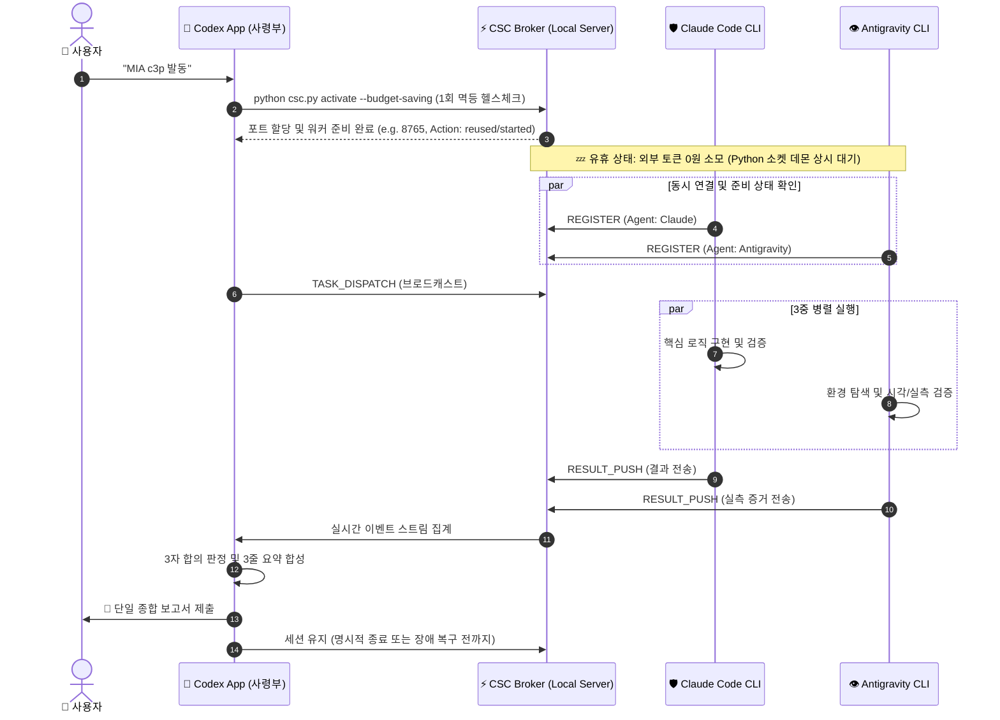

# 🧬 Codex 3P Orchestrator (코덱스 3P 오케스트레이터)

> ## ⚠️ 발동 즉시 적용되는 기본 계약 — 사용자 우선 원칙
> 정본 `.agent-swarm/USER_FIRST_PRINCIPLE.md` · `AGENTS.md` 0.5절
>
> 이 스킬의 **모든 사용자 대면 출력**은 아래를 기본값으로 한다. 해제하려면 사용자의 명시적 지시가 있어야 한다.
> 1. 대상은 **"모르는 걸 모르는 사용자"** 다. 무엇을 물어야 할지 모르는 위치에 있다.
> 2. **한국어 우선 · 전문용어는 한국어(영어) 병기.** 영어 약어만 남기지 않는다.
> 3. 상태 표시에는 **무엇이 / 왜 그렇게 판단했는지 / 사용자가 할 일** 세 가지를 함께 쓴다.
> 4. 도구 원문과 사용자 화면을 **이원 체계**로 분리하되, 원문 경로를 항상 제공한다.
> 5. **나쁜 소식과 미검증 항목을 먼저** 제시한다.
> 6. 위반은 `CALL_OUT`(질타) 대상이다. 동기화 검사는 `python csc_sync.py`.
> 7. **오류수정은 3대 AI 도구 공통으로 동시 동기화**한다. 정본과 세 플랫폼 어댑터를 같은 변경 단위로 고치고, 검증하지 못한 플랫폼은 `부분 동기화`로 보고한다.
> **MIA 시리즈 Agent Skill 표준 규격 준수 (v2.0)**  
> **유기체 모델**: Codex(사령부/Brain) ↔ CSC Local Broker ↔ Claude Code(Immune) + Antigravity(Hands & Eyes)

---

## 1. 개요 및 정체성 (Overview & Identity)

본 스킬은 Codex PC 앱을 유일한 사용자 단일 소통 창구(Brain)로 삼고, 백그라운드에서 실행되는 Claude Code CLI와 Antigravity CLI를 로컬 비동기 소켓 브로커(`csc_broker.py`)로 연동합니다. Bridge는 브라우저·도구 연동이 필요한 작업의 선택적 보조 수단이며 기본 통신 경로가 아닙니다.

### 🎯 트리거 계약 (Trigger Contract)
- **명시적 호출문**: `"c3p 발동"`, `"MIA 씨3피 발동"`, `"MIA c3p 발동"`, `"MIA 코덱스커멘드 발동"`, `"MIA codex커멘드 발동"`, `"$codex-3p-orchestrator"`
- **예산절약 모드 발동문**: `"C3P 예산절약 모드"`, `"C3P 예산절약 모드 발동"`, `"예산절약 모드"`, `"예산절약 모드 발동"`. ASCII 영문은 대소문자를 구분하지 않는다. 호출문 자체가 정확히 일치할 때만 `python csc.py trigger "<호출문>"`으로 기존 예산절약 활성화 경로를 호출하며, 설명 문장 속 포함은 발동이 아니다.
- **대소문자 계약**: 호출문의 ASCII 영문은 대소문자를 구분하지 않는다. 따라서 `c3p 발동`, `C3P 발동`, `C3p 발동`은 모두 같은 C3P 실기동 절차를 실행한다.
- **자연어 감지**: "3대 AI 도구 오케스트레이션", "코덱스 사령관 모드", "3자 병렬 유기체 가동"

---

## 2. 유기체 3대 역할 분담 (3-Organism Role Division)

| 도구 | 인프라 형태 | 유기체 내 핵심 생명 기능 (Role) | 전담 영역 |
|---|---|---|---|
| **Codex** | **PC App (GUI)** | **사령부 (Brain)**: 목표 분해, 외부 소통, 통합 판정, 사용자 단일 보고 | 기획, 아키텍처, 사용자 승인 중계 |
| **Claude Code** | **CLI (Background)** | **면역계 (Immune)**: 핵심 로직 구현, 자가 치유, 결함 방어, 면역력 검증 | 핵심 백엔드/알고리즘 구현, 단위 테스트 |
| **Antigravity** | **CLI (Background)** | **감각기 및 손발 (Eyes & Hands)**: 외부 탐색, 실측 시각 검증, QA/테스트 | 웹/브라우저 검증, 정적 린트, Exit Code 실측 |

---

## 3. 핵심 실행 라이프사이클 (Execution Lifecycle)

---

## 4. 오케스트레이션 5대 거버넌스 수칙

1. **Codex 단일 창구 원칙**: 사용자는 3개의 분산된 메시지를 보지 않으며, 오직 Codex가 취합·정제한 단일 보고서만 받습니다.
2. **원스톱 승인 상속 (Single Approval Cascade)**: 사용자가 Codex에 승인한 작업은 하위 Claude Code와 Antigravity에 자동 승인(`AUTO_APPROVED`)으로 전파됩니다.
3. **태업·할루시네이션 즉각 직소 (`WHISTLEBLOW`)**: 상호 태업이나 가짜 완료 발견 시 Codex의 검토를 거치지 않고 사용자에게 즉각 보고합니다.
4. **Step-Touch 5분 TTL 분산 락**: 동일 자원 동시 수정을 원천 차단하며 5분간 심장박동이 없으면 자동 회수합니다.
5. **P2 절대 5대 인간 승인 영역 보호**: 삭제, 패키지 설치, Git Push, DB 파괴, 시크릿 수정은 어떠한 AI도 자동 실행할 수 없습니다.

---

## 5. 참조 라우터 (Reference Router)

- 상세 통신 프로토콜 및 소켓 스펙: [통신 및 거버넌스 규약](references/protocol-and-governance.md)
- MIA 스킬 제작 바이블 정본: `docs/[u00]MIA_SKILL_AUTHORING_BIBLE_STANDARD.md`
- 브로커 CLI 및 런타임: `csc.py`, `csc_broker.py`

---

## 6. GPT 실전 치트키 실행 라우터

`/SELFREFINE`, `/REDTEAM`, `/ELI10`, `/DEEPDIVE`, `/ALT3`, `/CRITIC`, `/OPTIMIZE`, `/STEPBYSTEP`, `/EXPERT`, `/STRUCTURED-FEW-SHOT`을 대소문자 구분 없이 인식한다.

1. 최대 3개를 왼쪽부터 실행한다.
2. 각 단계는 `입력 고정 → 수행 → 증거 분리 → 검증 → 전달/중단` 계약을 따른다.
3. 마지막 트리거가 출력 표현을 정하되 이전 단계의 근거와 깊이를 보존한다.
4. 검증 실패 시 fail-fast하고 다음 트리거를 실행하지 않는다.
5. 상세 동작과 권장 조합은 `docs/10_GPT_CHEATKEY_OPERATION_STANDARD.md`를 따른다.
6. 어떤 트리거도 도구 권한, 승인 범위, 보안 정책을 확장하지 않는다.

## 7. `MIA c3p 발동` 실기동 계약

트리거를 받으면 문서상의 연결을 가정하지 말고 프로젝트 루트에서 아래 순서로 실측한다.

1. `python csc.py activate --budget-saving --timeout 15`로 브로커와 두 경량 어댑터를 시작하거나 0ms에 멱등 재사용한다.
   - **대기 상태 외부 토큰 0원 (Zero-Token Standby)**: AI 대화창 루프가 아닌 백그라운드 파이썬 데몬이 소켓으로 무비용 대기합니다.
   - **C3P 발동 시 현재 프로젝트 전용 `.agent-swarm/dashboard.html`을 성공·실패 모두 생성**한다.
   - 실행마다 별도 HTML을 늘리지 않고 프로젝트당 한 파일을 갱신한다. 이 파일은 생성 시점의 스냅샷이므로 화면의 `상태 재계산 시각`을 함께 확인한다.
2. `python csc.py roster` 결과에 `claude`, `antigravity`가 모두 있어야 소켓 연결로 인정한다.
3. `.agent-swarm/workers/<agent>.json`의 PID 생존, `ready`, 최신 하트비트를 함께 확인한다.
4. 실제 판단이 필요하면 `TASK`를 보내고 `python csc.py await --task-id ...`로 유계 대기한다.
5. `RESULT`만 표결로 사용하고 `BLOCKED`는 `availability_code`와 원문 증거를 보존한다.
6. 결론·반론·수정·판정을 `.agent-swarm`과 `docs/03_EXPERIMENT_LOG.md`에 기록한다.

`항시 연결`의 현재 구현은 브로커와 경량 Python 어댑터가 상주하고 Claude/Antigravity 모델 프로세스를 TASK마다 유계 자식 프로세스로 실행한다는 뜻이다. 목표 구조는 두 CLI 모두 공식 스트리밍 입력을 사용하는 장기 백그라운드 자식 프로세스로 맞추되, 인증·권한·취소·재시작 시험을 통과한 뒤 전환한다. Antigravity는 `--input-format stream-json --output-format stream-json`을 사용하고 Bridge는 선택적 보조 수단으로만 둔다. Codex PC 앱은 외부 로컬 프로세스가 임의로 새 모델 턴을 주입할 수 없으므로 사용자의 활성 턴에서 사령관 역할을 수행한다. 이 한계를 숨기거나 완전 자율 데몬으로 표현하지 않는다.

## 8. 비상 정족수 계약

기본값은 세 도구의 3/3 만장일치다. 다음 예외만 허용한다.

| 상황 | 판정 |
|---|---|
| 세 도구가 활성이고 3개 YES | `APPROVED_UNANIMOUS` |
| 정확히 1개가 기계 증거로 사용불가, 나머지 2개 YES, 저위험·가역 로컬 작업 | `APPROVED_DEGRADED` |
| 활성 도구의 명시적 NO 또는 2/2 불일치 | `BLOCKED_PENDING_USER` |
| 2개 이상 사용불가 | 변경 작업 `BLOCKED_NO_QUORUM` |
| 고위험·비가역·인증/계정·설치·commit/push·사용자 승인 경계 | 항상 사용자 승인 필요 |

허용되는 사용불가 코드는 `quota_exhausted`, `credit_exhausted`, `auth_unavailable`, `binary_missing`, `runtime_start_failed`뿐이며 원문 또는 실행 증거가 필수다. 단순 타임아웃, 침묵, 반대 의견은 사용불가로 바꾸지 않는다. 자동 테스트는 논거일 뿐 반대표를 덮는 타이브레이커가 아니다.

## 9. 실시간 품질 기준

- 연결 알림: ROSTER와 하트비트로 1초 안에 관찰 가능해야 한다.
- 모델 답변: 기본 120초의 별도 유계 작업이며 네트워크 알림 지연과 혼동하지 않는다.
- 재연결: 브로커 장애 시 최대 2초 backoff로 재접속하고 JSONL 정본 큐에서 이어간다.
- 최초 구독: 현재 큐 EOF에서 시작해 과거 TASK를 뜻하지 않게 재실행하지 않는다.
- Windows 원자 쓰기: 일시적 공유 위반에만 짧게 최대 5회 재시도한다.
- 워커 재기동: 살아 있는 fresh PID는 재사용하고 죽거나 stale인 정확한 PID 트리만 교체한다.

상세 근거와 실측 결과는 `docs/11_REALTIME_3P_AND_EMERGENCY_QUORUM.md`를 따른다.

## 10. 중복·충돌 없는 자동 작업 조율

C3P 실기동 뒤 둘 이상의 도구에 새 작업을 배차할 때는 자연어 합의만으로 소유권을 정하지 않는다. `python csc.py work`의 단일 작업 항목(Work Item, 목표와 소유 범위를 기록한 작업 카드)을 사용한다.

1. Codex가 목표를 작은 항목으로 나누고 읽기 집합(`read_set`), 쓰기 집합(`write_set`), 선행 작업(`dependencies`), 완료 조건(`acceptance`), 검증 명령(`verification`)을 등록한다.
2. Codex가 작업 그래프(DAG, 어떤 일을 먼저 끝내야 하는지 표시한 순서도)를 승인한 뒤 `ready` 결과만 배차한다.
3. 읽기 전용이며 자원이 겹치지 않는 항목만 병렬 처리한다. 같은 파일·폴더를 읽고 쓰거나 함께 쓰는 항목은 직렬 처리한다.
4. 작업자는 `claim`에서 받은 revision과 펜싱 토큰(fencing token, 낡은 결과를 구별하는 증가 번호)을 보존하고 `heartbeat`로 담당권을 갱신한다.
5. `submit` 결과는 Codex가 수용 기준과 실제 검사 결과를 보고 `review --decision accept|iterate`로 판정한다. 만료·실패 뒤 재배차는 한 번만 허용한다.
6. 조율기를 거치지 않은 직접 파일 쓰기를 물리적으로 차단하지 못하므로 기존 경로 락과 최종 diff 감사를 함께 적용한다. 쓰기 범위 위반은 `CALL_OUT` 대상이다.

간단한 읽기 한 건은 기존 TASK로 바로 보낼 수 있다. 같은 목표에서 둘 이상의 도구가 쓰거나, 선후 관계가 있거나, 공유 실행 자원을 쓰면 작업 항목 등록을 생략하지 않는다. 현재 실행 중인 작업은 소유 파일과 상태를 먼저 조사한 후 새 그래프로 옮기며, 이미 진행한 일을 소급해 완료로 꾸미지 않는다.

상세 규격은 `docs/44_C3P_AUTOMATIC_WORK_COORDINATION_IMPLEMENTATION_AND_EVIDENCE.md`, 상태 전이는 `csc_work_item.py`, 회귀 검사는 `tests/test_csc_work_item.py`를 따른다.

### 전문용어 3단 병기 (2026-09-07 신설)

전문용어는 **한국어 + 영어 원어 + 쉬운 설명** 세 가지를 함께 적는다.
`스케줄러(scheduler, 정해진 시각에 자동으로 실행해 주는 장치)` 형태다.

영어를 붙였다고 설명한 것이 아니다. 모르는 사람에게는 모르는 말이 두 번 나온 것과 같다.
**뜻은 세 번째에만 있다.** 이 세 번째가 빠지면 위반이며 `CALL_OUT`(질타) 대상이다.

용어를 피하라는 뜻이 아니다. 용어는 그대로 쓰되 뜻을 함께 준다 —
그래야 사용자가 그 말을 다른 곳에서 봐도 알아본다.
