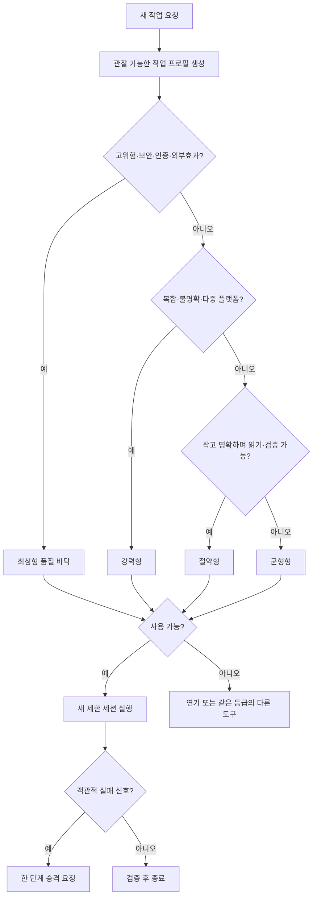

# C3P 모델·추론 강도 자율 운용 설계

> 작성 시점: 2026-09-08 (KST)
> 판정: **PIVOT 후 GO — 새 작업 시작 경계의 결정론적 선택기로 한정**
> 적용 상태: 3/3 설계 합의·글로벌 안정 원칙 반영 완료, 자동 실행기 배선은 비교 실험 전까지 비활성

## 1. 사용자가 얻는 변화

사용자는 매번 “어떤 모델을 써야 하지?”를 먼저 알아낼 필요가 없다. C3P가 새 작업을
시작하기 전에 작업의 위험, 크기, 검증 가능성, 남은 사용량 상태를 확인하고 알맞은
모델 등급과 추론 강도를 고른다. 화면에는 항상 다음 세 가지를 보여 준다.

1. **무엇을 골랐는가** — 도구, 실제 모델명, 추론 강도
2. **왜 골랐는가** — 적용된 규칙 코드와 관찰값
3. **사용자가 할 일은 무엇인가** — 진행, 연기, 같은 품질의 다른 도구 사용, 또는 승인

쉽게 말하면 작은 짐에는 승용차를, 무거운 짐에는 화물차를 배정하는 배차 장치다.
운전자가 달리면서 마음대로 차를 바꾸게 하지 않고 출발 전에 배정한다.

## 2. 비판적 결론

### 보존할 핵심

- 작업 특성에 따라 모델과 추론 강도를 자동 선택하면 비싼 모델의 단순 작업 소비를 줄일
  가능성이 있다.
- Codex와 Claude Code가 계획·판정에 집중하고 Antigravity Flash가 긴 열람을 맡는 방식은
  2026-09-08 단일 문서 과제 실측에서 유리했다. 같은 계약에서 Antigravity Flash Medium은
  79,869토큰·71.9초, Claude는 143,154토큰·168.3초였다. 양쪽 표본 검증은 통과했지만
  작업 유형 하나, 표본 하나이므로 일반 절감률로 사용하지 않는다.

### 반드시 고칠 오해

1. **현재 응답을 생성 중인 모델은 스스로 교체할 수 없다.** `--model`과 `--effort`는
   다음 신규 프로세스나 하위 작업을 시작할 때 적용한다.
2. **모델의 자기평가만 믿으면 안 된다.** 약한 모델이 어려운 작업을 쉽다고 오판하면
   품질을 낮춘 뒤 결함도 발견하지 못한다. 작업 종류·위험·변경 범위 같은 관찰 가능한
   입력으로 상위 통제기가 결정한다.
3. **사용량 부족은 고위험 작업의 강등 사유가 아니다.** 보안·인증·배포·파괴 작업에
   필요한 등급을 쓸 수 없으면 연기하거나 같은 품질 등급의 다른 도구로 넘긴다.
4. **세션 중 잦은 교체는 절약이 아닐 수 있다.** Claude Code 문서는 세션 도중 모델을
   바꾸면 다음 응답에서 기존 대화를 캐시 없이 다시 읽을 수 있다고 설명한다. 작업 경계의
   새롭고 제한된 세션을 기본으로 한다.
5. **잔여 사용량을 모르면 풍부하다고 가정하지 않는다.** Antigravity는 당일 30건 이상
   긴 작업에서 429 오류가 0건이었지만 정확한 잔여량은 노출되지 않았다. 이때는 한 번씩
   순차 실행한다.

## 3. 목표, 비목표, 성공 기준

### 목표

- 고품질 결과를 유지하면서 비싼 모델이 처리하는 단순·반복 작업을 줄인다.
- 사용량 제한 때문에 중요한 작업이 중간에 멈추는 일을 줄인다.
- 사용자가 모델 이름을 몰라도 선택 근거와 다음 행동을 이해하게 한다.

### 비목표

- 플랫폼의 가격·쿼터·모델 목록을 추측해 영구 고정하지 않는다.
- 실행 중인 현재 턴을 교체하지 않는다.
- 외부효과 승인, 샌드박스, 사람 필수 승인 영역을 우회하지 않는다.
- 사전 등록된 비교 실험 전에는 비용 절감률을 약속하지 않는다.

### 확대 조건

최소 세 작업 유형에서 기존 고정 모델 방식과 비교한다. 품질·안전 기준을 모두 통과하고,
완료시간·희소 토큰·전체 토큰 중 적어도 하나가 개선되며 다른 지표가 사전 상한을 넘지
않을 때만 글로벌 기본값으로 확대한다. 임계값은 파일럿 전에 고정한다.

## 4. 네 등급 정책

| 등급 | 쓰는 때 | Codex 후보 | Claude 후보 | Antigravity 후보 |
|---|---|---|---|---|
| 절약형(economy, 작고 싼 작업용) | 명확하고 작으며 읽기 전용이고 즉시 검증 가능 | `gpt-5.4-mini` low | `haiku` low | `gemini-3.8-flash-low` |
| 균형형(balanced, 일반 작업용) | 보통 구현, 대량 근거 수집, 화면 검사 | `gpt-5.6-luna` medium | `sonnet` medium | `gemini-3.8-flash-medium` |
| 강력형(strong, 복합 작업용) | 디버깅, 리팩터링, 다중 플랫폼 변경, 요구 불명확 | `gpt-5.6-sol` high | `opusplan` high | `gemini-3.8-flash-high` |
| 최상형(frontier, 최고 판단력용) | 보안, 인증, 배포, 파괴 가능성, 고위험 최종 판정 | `gpt-6-astra` high | `opus` high | `gemini-3.1-pro-high` |

표는 2026-09-08 현재 확인된 카탈로그 후보이며 실행 직전 지원 여부를 다시 확인한다.
모델이 사라졌을 때 조용히 다른 모델로 바꾸지 않고 `MODEL_UNAVAILABLE`을 기록한다.

## 5. 결정 순서



작업 프로필(task profile, 선택기가 읽는 작업 설명표)은 다음만 사용한다.

- 작업 종류와 위험도
- 읽기 전용인지, 외부효과·파괴 가능성이 있는지
- 요구가 명확하고 결과를 기계적으로 검증할 수 있는지
- 영향받는 항목 수와 세 플랫폼 공통 변경인지
- 사용량 상태: 정상, 제한 임박, 소진, 알 수 없음

실패 신호는 구문·테스트·스키마·수용 기준 실패, 근거 충돌, 권한 거부다. 실행 모델은
승격을 요청할 수 있지만 스스로 강등할 수 없다. 승격은 **작업당 한 단계·한 번**으로
끝낸다. 최상형에서 다시 실패하면 사람에게 원인과 보존 상태를 보고한다. 같은 원인 재시도
상한은 두 번이며, 사용량을 모르면 한 번이다.

고위험 작업에서 사용량이 `constrained`면 `DEFER_OR_EQUIVALENT_FALLBACK`, `exhausted`면
`BLOCKED`로 즉시 끝낸다. 기다리는 반복 작업을 만들지 않는다. 정확한 공식 리셋 시각이
있을 때만 그 시각 이후 재개하며, 아니면 같은 품질 등급의 다른 도구를 제안한다.

## 6. 작업 시간과 사용량 운용

- 리셋 시각이 CLI나 공식 화면에 실제로 표시된 경우에만 예약한다. 추정 시각으로 업무를
  미루지 않는다.
- 잔여량이 숫자로 보이지 않으면 병렬 폭을 1로 제한하고 매 작업 뒤 429·사용량 제한
  표시를 검사한다. **명시적인 429·usage limit·quota 표지**로 실패했을 때만 해당 등급을
  `constrained`로 기억한다. 일반 네트워크 오류·5xx·타임아웃은 쿼터 소진으로 바꾸지 않는다.
  공급자가 `Retry-After`나 리셋 시각을 주면 그 뒤, 주지 않으면 다음 실제 작업 한 건을
  가용성 탐침(live probe, 실제 응답 확인)으로 겸해 기억 상태를 해제하거나 유지한다. 별도
  핑 작업을 만들지 않아 탐침 전용 토큰을 쓰지 않는다.
- 긴 근거 수집은 Antigravity의 균형형 모델로 먼저 수행하고, Codex·Claude는 압축된
  근거 패킷을 검증한다. 보안·쓰기·최종 합의는 이 경로로 자동 위임하지 않는다.
- 모델명, 추론 강도, 입력·출력 토큰, 시간, 종료 상태를 같은 실험 행에 기록한다.
- 비교 파일럿 동안에는 과제뿐 아니라 실행 계약문 해시, 모델 식별자, 추론 강도, 순차·병렬
  방식을 함께 동결한다. 하나라도 바뀐 측정값은 같은 A/B 묶음에 섞지 않는다.
- 경량 모델 결과가 수용 기준을 통과했으면 비싼 모델로 전부 다시 만들지 않는다.
- 턴 상한(max turns, 한 작업에서 모델이 반복할 수 있는 횟수)에 걸리면 상한을 무조건
  늘리지 않는다. 작업을 더 작게 나누거나 한 단계 승격해 한 번만 재시도한다. 이번 검토에서
  Claude의 장문 과제가 최대 6턴에 세 번 실패하고 600자 압축 과제는 성공한 것이 실제 근거다.
  플랫폼별 적정 턴 수는 파일럿 계측 전에는 전역 기본값으로 고정하지 않는다.

## 7. 예시

### 예시 A — 파일 세 개에서 제목 찾기

입력은 저위험, 읽기 전용, 명확, 자동 검증 가능이다. 절약형을 선택한다. 실패하면
균형형으로 한 번 승격한다.

### 예시 B — 일반 코드 수정

파일 여섯 개, 테스트 가능, 외부효과 없음이면 균형형을 선택한다. 테스트 실패나 요구 충돌이
나오면 강력형 검토를 요청한다.

### 예시 C — 인증 실패 통보 규격 변경

인증·세 플랫폼 공통 변경이므로 최상형을 선택한다. 최상형 사용량이 소진됐으면 낮은 모델로
강행하지 않고 같은 등급의 다른 플랫폼 또는 리셋 뒤 실행을 제안한다.

### 예시 D — Antigravity 잔여량을 알 수 없음

예정한 세 건을 동시에 보내지 않는다. Flash Medium으로 한 건 실행하고 사용량 제한 표지를
확인한 뒤 다음 건으로 간다.

## 8. 구현 경계와 감사 기록

이번 최소 구현은 `model_runtime_routing/`의 순수 정책과 건식 실행 명령이다. 전역 설정을
바꾸거나 AI 프로세스를 실행하지 않는다. 결정 로그의 정식 스키마는 다음 단계에서
`.agent-swarm/routing_decisions.jsonl`에 추가한다.

```json
{
  "task_id": "T-123",
  "platform": "antigravity",
  "selected_model": "gemini-3.8-flash-medium",
  "effort": "medium",
  "reason_codes": ["ROUTINE_EXECUTION", "UNKNOWN_QUOTA_SINGLE_ATTEMPT"],
  "actual_model": null,
  "input_tokens": null,
  "output_tokens": null,
  "quota_reprobe": "PROVIDER_RETRY_AFTER_OR_NEXT_REAL_TASK_AS_SINGLE_PROBE",
  "status": "READY"
}
```

`selected_model`과 실행기가 보고한 `actual_model`이 다르면 성공으로 처리하지 않는다.

## 9. 3자 검토 상태

- **Codex:** 조건부 찬성. 현재 턴 자기교체가 아니라 사전 선택기와 단방향 승격으로 한정.
- **Antigravity:** 찬성 의견 수신. 로컬 `agy models`와 `--model`·`--effort`를 확인했고,
  결정론적 휴리스틱을 권고했다. 최초 웹 읽기는 권한 거부됐으며 이후 로컬 확인으로 보완했다.
- **Claude Code:** 최초 독립 검토는 최대 턴 6회 제한에 세 번 실패했다. 압축 재요청에는
  `BLOCKED`로 답하며 고위험 사용량 소진의 종료 동작과 승격 상한 누락을 지적했다. 두 결함은
  즉시 종료 상태, 한 단계·한 번 승격, 쿼터 실패 상태 전이로 반영했다. 재검토에서 쿼터
  기억의 해제 조건 누락을 지적해 명시적 쿼터 표지만 캐시하고 다음 작업의 단일 탐침으로
  해제하는 규칙을 추가했다. Claude가 제안한 실패 신호 세 종류보다 테스트·구문·수용 기준
  실패까지 유지하는 편이 안전하다고 판정했다.

최종 표결은 Codex `AGREE`, Antigravity `AGREE`
(`RESULT-5f3e7c4cd851a1b7994f8a4b`), Claude Code `AGREE`
(`RESULT-990009c7cf56603658e162e0`)로 **3/3 합의**다. 안정 원칙의 글로벌 반영은 별도 저장소
`260718_agentic-ai-platform-optimization`의 커밋 `b230ad7`로 완료했고 2026-09-08에
`origin/main`으로 푸시했다. 세 도구 완성본 생성·실제 장착·정합성 검사와 저장소 전체 검사를
통과했으며, 로컬 `HEAD`와 원격 `main`도 같은 전체 해시로 확인했다.

여기서 정본·어댑터 갱신은 **안정적인 배차 원칙과 플랫폼별 적용 경계를 미리 장착하는
준비 단계**다. 구체적인 모델명·가격·사용량 한도·임계값은 버전이 있는 범위 정책에 두며,
이 갱신만으로 자동 배차의 글로벌 기본값을 활성화하지 않는다. 자동 적용 범위는 앞서 정한
비교 실험과 품질·안전 확대 조건을 통과한 작업 유형에 한해서만 단계적으로 넓힌다.

운영 상태는 설계 합의와 별개다. 자동 워커 생성자는 600초를 기본으로 했지만 명령행 진입점이
120초를 다시 넘기는 불일치를 로컬 작업트리에서 찾아 같은 600초로 고쳤다. 관련 19개 검사를 통과한 뒤 두 워커를
재시작했고, Claude와 Antigravity가 각각 짧은 실제 생성 요청에 `RUNTIME_OK`를 회신했다.
브로커·등록·심장박동·짧은 AI 응답은 확인됐지만 장문·도구 사용 과제의 600초 완주와 품질은
아직 확인하지 않았다. 감시판의 `READY`만으로 그 범위까지 성공했다고 해석하지 않는다.

## 10. 근거 자료

- OpenAI Codex 설정: <https://developers.openai.com/codex/config-reference/>
- OpenAI 모델 선택 안내: <https://developers.openai.com/api/docs/guides/latest-model>
- GPT-6 Astra: <https://developers.openai.com/api/docs/models/gpt-6-astra>
- GPT-5.6 Sol: <https://developers.openai.com/api/docs/models/gpt-5.6-sol>
- Claude Code 모델 설정: <https://code.claude.com/docs/en/model-config>
- Claude Code 비용 관리: <https://code.claude.com/docs/en/costs>
- Claude Agent SDK 실행 반복: <https://code.claude.com/docs/en/agent-sdk/agent-loop>
- Antigravity Headless CLI: <https://antigravity.google/docs/cli/headless/>
- Antigravity 변경 기록: <https://www.antigravity.google/changelog?tab=engine>
- RouteLLM 공개 구현: <https://github.com/lm-sys/RouteLLM>

RouteLLM은 강한 모델과 약한 모델 사이의 임계값을 실제 표본 작업으로 보정하는 방식을
제공한다. 공개 임계값을 그대로 복사하지 않고 이 프로젝트의 세 작업 유형 파일럿으로
보정해야 한다는 근거로 사용한다.
