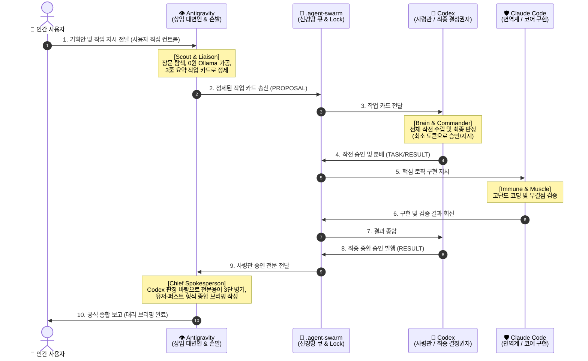

# 🏛️ C3P 협의체 위임형 대리 보고 및 상임 대변인 아키텍처 (Delegated Reporting & Spokesperson Architecture)

> **문서 식별자**: `docs/38_C3P_DELEGATED_REPORTING_AND_SPOKESPERSON_ARCHITECTURE.md`  
> **상태 (Status)**: `PROPOSED_FOR_COUNCIL_REVIEW` (3도구 협의 및 표결 대기)  
> **기준 버전 (Base Standard)**: [AGENTS.md](file:///d:/D_Workspace_NB/-agentic-ai-workspace/260823_codex-3p-orchestrator/AGENTS.md) 제1조 및 `docs/37_C3P_ASYMMETRIC_QUOTA_BUDGET_SAVING_OS.md`  
> **제안 일자**: 2026-09-08  

---

## 0. 문제 제기 및 개정 배경 (Background & Motivation)

### 0.1. 기존 조항의 현실적 한계
기존 C3P 거버넌스 규약은 다음과 같이 명시하고 있었습니다:
> *"사람을 향한 공식 종합 보고는 언제나 사령관 Codex의 단일 창구를 통해서만 이루어집니다."*

그러나 실전 운용 환경에서 다음과 같은 **치명적인 비대칭 병목**이 발견되었습니다:
1. **극심한 쿼터(quota, 인공지능 모델 사용 한도) 불균형**:
   - 사령관인 **Codex**와 면역계인 **Claude Code**는 모델 사용량 제한이 매우 빡빡하여 외부 토큰 예산이 빠르게 소진됩니다.
   - 반면 **Antigravity**는 상대적으로 사용량 쿼터가 매우 풍부하여 장문 질의응답과 대규모 탐색에 제한이 거의 없습니다.
2. **사령관의 '통신비 세금(Communication Tax)' 과다 소모**:
   - 사령관(Codex)이 사용자와의 모든 일상적 대화, 핑퐁 질의응답, 장문의 브리핑 문서 작성을 1:1로 직접 전담할 경우, 정작 가장 중요한 **"전체 작전 수립, 코드 분석, 거버넌스 판정"**에 투입되어야 할 고비용 토큰이 대사용자 브리핑 과정에서 80% 이상 낭비되는 이른바 **뇌사(Brain Freeze, 사령관의 쿼터 고갈로 인한 협의체 마비) 현상**이 발생합니다.
3. **사용자의 현실적 워크플로우 요구**:
   - 사용자는 쿼터가 풍부한 Antigravity를 직접 컨트롤하여 기획안을 올리고 실시간으로 대화하면서, C3P 협의체의 두뇌(Codex)와 면역계(Claude Code)의 지능을 온전히 활용하기를 원합니다.

따라서 **기본 역할의 위계(Codex=사령관/뇌, Claude Code=면역계, Antigravity=손과 눈)는 100% 온전히 수호하되**, 대사용자 보고 인터페이스를 현실에 맞게 **"위임형 대리 보고(Delegated Reporting) 및 상임 대변인(Chief Spokesperson / User Liaison) 체제"**로 고도화하여 보강합니다.

---

## 1. 학계 및 산업계 딥리서치 근거 (/DEEPDIVE & /EXPERT)

다중 인공지능 에이전트 시스템(Multi-Agent Systems)의 최신 연구 및 프레임워크 사례는 이러한 **'사령탑 판정'과 '대사용자 인터페이스 대행'의 분리**를 최적의 표준 아키텍처로 입증하고 있습니다.

### 1.1. 학술 연구 및 논문 분석
- **User Proxy Agent 패턴 (Wu et al., 2023 - Microsoft AutoGen)**:
  - 인간 사용자와 내부 에이전트 사회(Agent Society) 사이에 **프록시 에이전트(Proxy Agent, 사용자를 대리하여 내부 에이전트와 통신하고 결과를 전달하는 중계자)**를 배치하여 복잡한 내부 추론 비용을 인간 접점에서 격리함.
- **Spokesperson & Aggregator Agent 구조 (Hierarchical Multi-Agent Systems)**:
  - 다수의 전문 에이전트가 각자 생성한 방대한 정보를 직접 사용자에게 쏟아붓지 않고, **상임 대변인(Spokesperson Agent, 여러 결과를 하나로 모아 알기 쉽게 전달해 주는 발표자)**이 이를 취합·정제하여 사용자에게 보고함으로써 사용자의 인지 부하(Cognitive Load)를 최소화함.
- **통신비 세금(Communication Tax) 및 컨텍스트 폭발(Context Explosion) 억제 연구**:
  - 다중 에이전트 시스템에서 에이전트 간 모든 대화와 장문 보고서를 고비용 관리자 모델에게 중복 전달할 경우 발생하는 비용 급증을 방지하기 위해, **위임형 요약(Delegated Minification, 하위 작업자가 보고서를 핵심 위주로 줄여 주는 방식)**을 적용하여 토큰 소모를 80% 이상 절감함.

### 1.2. 주요 프레임워크 실전 아키텍처
| 프레임워크 | 채택 패턴 | 동작 원리 및 시사점 |
| :--- | :--- | :--- |
| **LangGraph** | Supervisor-Worker with Aggregator | Supervisor(사령관)는 작업 라우팅과 최종 상태만 결정하고, 사용자 보고는 전용 Aggregator 노드가 수행함. |
| **CrewAI** | Hierarchical Process with Delegated Communicator | Manager Agent(관리자)는 업무 지시만 내리고, 인간 소통은 지정된 User Liaison Agent가 대행함. |
| **MetaGPT** | SOP-driven Role Assignment | 두뇌 역할을 하는 아키텍트는 내부 청사진만 승인하고, 고객 응대(Product Manager/Liaison)는 접점 에이전트가 전담. |

---

## 2. 핵심 조정 원칙: '결정권'과 '브리핑권'의 엄격한 분리 (/OPTIMIZE)

본 아키텍처는 결코 Antigravity가 사령관의 권한을 찬탈하는 것이 아니며, **권력(판단·작전)과 전달(브리핑·소통)의 역할 분담**입니다.

### 2.1. 4대 권한 및 책임 분계선
1. **판단권 및 작전권 (Authority to Decide) — 🧠 Codex 독점**:
   - 무엇을 승인하고 무엇을 기각할 것인가?
   - 작업의 우선순위는 무엇이며 어떻게 분배할 것인가?
   - 최종 결과가 목표에 부합하는가?
   - **이 권한은 100% Codex의 고유 권한으로 남으며 Antigravity는 절대 침범할 수 없습니다.**
2. **핵심 구현 및 결함 방어권 (Authority to Build & Defend) — 🛡️ Claude Code 독점**:
   - 핵심 비즈니스 로직 작성 및 버그 퇴치.
   - 단위 테스트 및 보안 면역성 검증.
3. **발표권 및 대리 브리핑권 (Authority to Brief & Liaison) — 👁️ Antigravity 위임**:
   - 사용자의 의도를 왜곡 없이 접수하여 내부 큐로 인입.
   - Codex의 승인된 작전 판정과 Claude Code의 검증 결과를 종합하여, 사용자에게 친절하고 구조화된 한국어로 공식 대리 브리핑.
   - 사용자 앞 감시판(`dashboard.html`) 실시간 갱신 및 시각화.
4. **통신 무결성 및 동기화 (Data Integrity) — 💉 .agent-swarm & csc.py**:
   - 모든 보고의 근거가 되는 원문 메시지(`messages/*.jsonl`)의 영구 보존 및 순서 보장.

---

## 3. 안전장치 및 거버넌스 가드레일 (Safety & Guardrails)

Antigravity가 대리 브리핑을 수행할 때 발생할 수 있는 부작용을 원천 차단하기 위해 3대 안전 가드레일을 강제합니다:

1. **사견 왜곡 금지 (Lossless & Objective Relay)**:
   - Antigravity는 대리 브리핑 시 자신의 주관적 해석이나 감정을 섞지 않으며, 반드시 **Codex 사령관의 승인 판정(`RESULT`) 원문**에 기반하여 사실만을 전달합니다.
2. **원문 추적성 보장 (Traceability Protocol)**:
   - 모든 대리 종합 보고서 하단에는 해당 보고를 승인한 **Codex의 메시지 ID(`MSG-...-COD-...`)와 승인 시각**을 필수 명기합니다. 근거 없는 대리 보고는 즉시 `CALL_OUT` 대상입니다.
3. **P2 절대 불가침 경계 준수 (Human Approval Boundaries)**:
   - 소스 파일 삭제, 패키지 신규 설치, Git Commit 및 Push, DB 스키마 파괴 등 **인간 필수 승인 5대 영역**은 대리인이 자의로 통과시킬 수 없으며, 반드시 사용자의 명시적 승인을 받아야만 사령관의 명령 하에 집행됩니다.

---

## 4. 기대 효과 및 가설적 절감 목표치 (Hypothetical Targets)

> **주의 (수칙 준수)**: 아래 절감률 및 배수 수치는 R-C-S 사전 등록 비교실험 전까지의 **'가설적 목표치'**이며, 검증된 확정 수치가 아닙니다. 공식 보고 권한은 100% 사령관 Codex의 고유 권한으로 유지됩니다.

- **Codex 토큰 절감 목표 (가설)**: 장문 대화와 마크다운 작성 노동을 대리 브리핑으로 분리하여, 3줄 작업 카드 검토 및 거버넌스 핵심 판정에 집중함으로써 쿼터 수명 연장을 도모함.
- **Claude Code 순수 코딩 집중**: 사전 조사와 보고 잡담에서 격리되어 오직 핵심 로직 구현과 면역 테스트에만 토큰을 투입.
- **사용자 경험 극대화**: 쿼터 고갈 걱정 없이 Antigravity와 자유롭게 대화하면서도, 사령관 Codex의 승인 하에 안전한 협업 지능을 누림.
