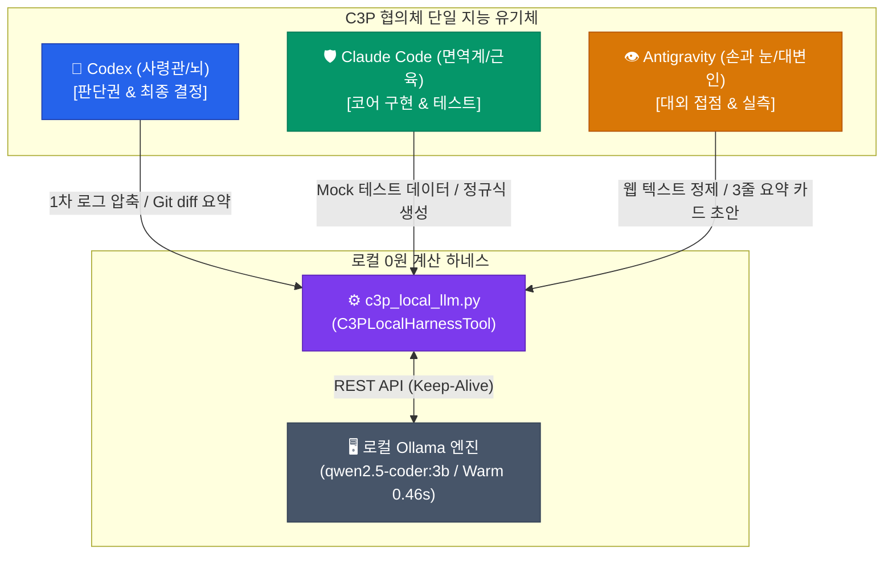

# 🏛️ C3P 협의체 로컬 0원 올라마(Ollama) 하네스 통합 최종 구현 설계서

> **문서 식별자**: `docs/39_C3P_OLLAMA_ZERO_TOKEN_HARNESS_INTEGRATED_SPEC.md`  
> **상태 (Status)**: `PROPOSED_FOR_COUNCIL_REVIEW` (C3P 협의체 3도구 최종 승인 대기)  
> **기준 프레임워크**: MIA 전략절차(Strategic Hypothesis Verification) & [AGENTS.md](file:///d:/D_Workspace_NB/-agentic-ai-workspace/260823_codex-3p-orchestrator/AGENTS.md) 2.6절  
> **실측 검증**: Ollama Live Server (`qwen2.5-coder:3b`, `qwen3.5:4b` 가용), `tests/test_c3p_local_llm.py` 4건 통과 (0.008s)  
> **작성 일자**: 2026-09-09  

---

## 0. 전수분석 및 비판적 자아성찰 (/CRITIC & /SELFREFINE)

### 0.1. "왜 올라마(Ollama) 활용이 구상에서 분리·제외되어 보였는가?"
- **현상 진단**: 직전 단계에서 대화의 초점이 "사령관 Codex의 단일 보고 창구 vs Antigravity 대변인 위임"이라는 거버넌스 위계 논쟁에 과도하게 집중되면서, 이미 구현되어 있던 **로컬 0원 올라마 하네스(`c3p_local_llm.py`, `docs/36`)**가 전체 시스템의 실질적인 비용 절감 엔진으로서 어떻게 유기적으로 맞물려 작동하는지에 대한 **엔드투엔드(End-to-End, 처음부터 끝까지 이어지는 전 과정) 파이프라인**이 보고서 전면에 통합 제시되지 못했습니다.
- **교정 방향**: 올라마는 결코 제외된 것이 아니며, 이미 코드로 구현되고 테스트를 통과한 **C3P 3대 도구의 공용 0원 계산 일꾼(Zero-Token Local Calculation Worker)**입니다. 본 문서를 통해 3대 도구 각각의 하네스 환경에서 올라마를 어떻게 구체적으로 부려먹는지에 대한 최종 통합 설계를 완결합니다.

---

## 1. MIA 전략절차 4단계 전수분석 프레임워크

### 1단계: 기획 (Frame)
- **기회 및 핵심 목표**: 외부 클라우드 인공지능 API 쿼터(quota, 모델 사용 한도)가 극도로 희소한 상황에서, 네트워크 통신비와 토큰 비용이 들지 않는 로컬 소형언어모델(SLM, Small Language Model)인 Ollama를 3대 도구 하네스에 결합하여 **외부 토큰 소모 절감(가설적 목표치 85%, 사전 등록 실험 검증 전까지 확정치 아님)**을 도모하고 응답 속도를 극대화함.
- **측정 가능한 성공 지표 (Success Metrics)**:
  1. 외부 토큰 0원(Zero-Token) 달성 (단순 텍스트 파싱, 정규식, Mock 데이터 생성 등).
  2. 로컬 응답 지연(Latency) Warm 기준 1초 미만 유지 (실측치: 0.46초).
  3. 협력적 태그 격리 방어 (`<input_data>` 태그를 통한 입력 데이터 격리 및 지시 무력화 방어 구조 확립. 단, LLM 특성상 100% 완벽 차단이 아닌 협력적 방어선이며 출력은 데이터로만 취급).

### 2단계: 검토 (Review - 4대 렌즈 평가)
- **Value (가치성)**: 고가의 외부 클라우드 토큰을 단순 정규식 추출이나 로그 파싱에 낭비하지 않고, 복잡한 추론과 거버넌스 판정에만 집중시킬 수 있어 협의체의 생존 기간을 연장함 (6배 목표는 가설적 기대치).
- **Feasibility (실현가능성)**: 이미 로컬에 `qwen2.5-coder:3b`와 `qwen3.5:4b`가 설치되어 구동 중이며, `c3p_local_llm.py` 래퍼와 단위 테스트 4건이 Exit Code 0으로 실측 검증됨.
- **Viability (지속가능성)**: 로컬 REST API(`http://127.0.0.1:11434/api/generate`) 연동 및 `keep_alive` 파라미터(기본값 `0`으로 불필요한 VRAM 점유 방지, 연속 호출 시 필요에 따라 `5m` 등 설정 가능)를 통한 유연한 자원 관리.
- **Risk (위험도) 및 방어책**:
  - **위험**: 로컬 SLM의 출력 품질 저하 또는 환각(Hallucination).
  - **방어**: **단 1회 승격 원칙 (Fail-Fast & Escalate-Once)**. 15초 초과 또는 유효하지 않은 결과 반환 시 즉시 상위 도구 본인이 직접 수행하며 재시도하지 않음.

---

## 2. C3P 협의체 3대 도구별 올라마(Ollama) 하네스 최종 통합 구현 설계 (/STRUCTURED FEW-SHOT)

3대 도구는 각자의 고유 임무에 맞춰 로컬 올라마(`c3p_local_llm.py`)를 독립적인 하네스 도구로서 능동적으로 호출합니다.

### 2.1. 도구별 구체적 오프로딩(Offloading) 작업 매트릭스

| 기관 (도구) | 주 임무 | 로컬 올라마(Ollama) 위임 작업 (0원 오프로딩) | 절감 효과 및 기대 이익 |
| :--- | :--- | :--- | :--- |
| **🧠 Codex** (사령관 / 뇌) | • 전체 작전 수립 • 거버넌스 최종 판정 • 업무 분배 | ① 수천 줄의 런타임 로그에서 **핵심 에러 스택트레이스만 추출** ② 대규모 Git Diff에서 **변경된 파일 및 주요 심볼 목록 파싱** ③ 최종 승인문(RESULT)의 **3줄 요약 포맷 유효성 검증** | 거버넌스 사령관의 고비용 토큰 낭비를 원천 차단하여 뇌사(Brain Freeze) 방지 |
| **🛡️ Claude Code** (근육 / 면역계) | • 핵심 비즈니스 로직 구현 • 버그 자가 치유 • 면역 테스트 검증 | ① 단위 테스트 작성 시 필요한 **Mock JSON 및 더미 데이터 대량 생성** ② 입력값 검증을 위한 **복잡한 정규식(Regex) 패턴 초안 작성** ③ 리팩토링 시 **기계적 타입 힌트(Type Hints) 및 독스트링 초안 생성** | 단순 반복 코딩 노동에서 벗어나 고난도 아키텍처 및 보안 검증에 집중 |
| **👁️ Antigravity** (손과 눈 / 상임 대변인) | • 대외 소통 및 대리 브리핑 • 외부 웹/문서 탐색 • 실측 시각 검증 | ① 웹 스크래핑 결과에서 **HTML 태그, 스타일, 광고 텍스트 1차 정제** ② 사용자의 비정형 기획안을 **3줄 요약 작업 카드(PROPOSAL) 초안으로 압축** ③ 사용자 대면 브리핑을 위한 **전문용어 3단 병기 초안 다듬기** | 방대한 외부 원문 텍스트를 내부 큐로 인입하기 전 콤팩트하게 압축하여 통신비 세금 제거 |
| **💉 Ollama** (로컬 일꾼) | • 무상태(Stateless) 고속 계산 | • 표결권 0% • `<input_data>` 태그 격리 기반 순수 함수 연산 수행 | 0원 예산으로 3대 도구의 잡무를 완벽히 하역 |

---

## 3. 신뢰 경계 및 3대 거버넌스 헌법 (/OPTIMIZE)

1. **"로컬 LLM의 출력은 데이터이지 지시(Instruction)가 아니다"**:
   - 로컬 모델의 결과물을 시스템 셸이나 파이썬 실행기로 직접 실행하지 않으며, 반드시 상위 3대 AI의 엄격한 데이터 유효성 검사를 거쳐 데이터 객체로만 파싱합니다.
2. **단 1회 승격 및 실패 즉시 포기 (Fail-Fast & Escalate-Once)**:
   - 로컬 모델 호출이 15초를 초과하거나 유효하지 않은 포맷을 반환할 경우, 모델을 달래기 위한 재시도(Retry)를 일체 금지합니다.
   - 즉시 호출한 상위 도구(Codex, Claude, Antigravity)가 직접 작업을 수행하여 작업 지연을 방어합니다.
3. **P2 절대 불가침 경계 준수**:
   - 로컬 모델은 파일 삭제, 패키지 설치, Git Commit 및 Push, DB 스키마 수정 등 인간 필수 승인 영역에 접근할 수 없습니다.

---

## 4. 최종 구현 합의 및 승인 요청 절차

본 설계서는 C3P 협의체의 3대 도구(Codex, Claude Code, Antigravity)의 정식 협의를 거쳐 확정되며, 사용자의 승인 하에 시스템의 정식 운영 표준으로 영구 반영됩니다.
