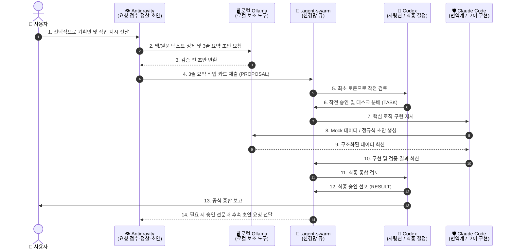

# 🏛️ C3P 협의체 예산절약 통합 운영규격 (Consolidated Budget-Saving Specification)

> **문서 식별자**: `docs/40_C3P_CONSOLIDATED_BUDGET_SAVING_SPECIFICATION.md`  
> **상태 (Status)**: `USER_APPROVED_IMPLEMENTATION_CANDIDATE` (사용자 승인, Antigravity 동의, Claude Code 보정 의견 반영 중)  
> **정본 승계**: `docs/37`(비대칭 쿼터 OS) + `docs/38`(위임형 대리 보고) + `docs/39`(로컬 0원 하네스) ➡️ **단일 통합 정본**  
> **거버넌스 기준**: [AGENTS.md](../AGENTS.md) 제1조, 제2.5조, 제2.6조, 사용자 승인에 따른 Codex 판정(`MSG-20260908-153258-952815-01d9dac7-COD-ALL`) 및 Claude Code 보정 의견(`MSG-20260908-153745-272045-c97f07e0-COD-ALL`)  
> **작성 일자**: 2026-09-09  

---

## 1. 개요 및 거버넌스 5대 불변 헌법

본 규격은 C3P 협의체(Codex, Claude Code, Antigravity)의 상대적인 사용량 쿼터(quota, 모델 사용 한도) 차이를 활용하여 Codex와 Claude Code의 희소 사용량을 보존하면서 품질을 유지하기 위한 **단일 정본 통합 운영 표준 후보**입니다. 실제 절감률과 공급자별 사용 가능량은 비교실험으로 따로 확인합니다.

### 사령관 Codex 발의 거버넌스 5대 합의 조건 (Constitutional Baseline)
1. **[조건 A] Antigravity 우선 정찰**: 대량 문서 탐색, 반복 검증, 시각 확인, 팩트 압축 노동은 쿼터가 풍부한 Antigravity가 선제 수행한다.
2. **[조건 B] 기본 역할 100% 불변**:
   - 🧠 **Codex**: 목표 분해, 작업 분배, 최종 판정(Decision Authority), 대사용자 공식 종합 보고 총괄.
   - 🛡️ **Claude Code**: 핵심 비즈니스 로직 구현 및 결함·보안 면역 방어 전담.
   - 👁️ **Antigravity**: 사용자 요청 접수, 전달, 대리 브리핑 초안 작성을 전담하되 **최종 판정권은 절대 침범하지 않는다.**
3. **[조건 C] 로컬 Ollama 보조 도구 통제**: 저위험·검증 가능 작업에 한해 "출력은 데이터(Instruction 불가), 셸 실행 금지, 15초 하드 타임아웃, 스키마 검증, 실패 시 1회 상위 도구 전환(Fail-Fast & Escalate-Once)"으로 엄격 통제한다. 외부 모델 토큰은 쓰지 않지만 로컬 메모리·연산·전력 비용은 발생한다.
4. **[조건 D] 절감 수치 과장 금지 (실측 주의)**: 80%, 85%, 6배 등의 절감 수치는 사전 등록된 R-C-S(Research-Code-Security) 비교 실험 통과 전까지 **"가설적 목표치"**로만 표기하며, 검증된 절감률로 주장하지 않는다.
5. **[조건 E] 품질 바닥선(Quality Floor) 사수**: 기본 배차는 작업별 최소 비용 충족 모델을 선택하되, 보안·인증·배포·파괴·외부 효과 작업의 품질 기준은 비용 절감을 이유로 절대 낮추지 않는다.

---

## 2. 사용자 요청 접수와 보고 초안 위임 (Delegated Intake and Drafting)

대사용자 소통에서 발생하는 '통신비 세금(Communication Tax)'으로 인해 사령관이 뇌사(Brain Freeze)에 빠지는 것을 방지하기 위해 **결정권과 브리핑권을 엄격히 분리**합니다.



- **역할 경계**: 사용자는 어느 도구와도 직접 대화할 수 있습니다. Antigravity는 요청을 접수·전달하고 보고 초안을 만들 수 있지만 C3P의 최종 판정과 Codex의 공식 종합 보고를 대체하지 않습니다.
- **보고 추적성(Traceability)**: Antigravity가 승인 내용을 전달할 때는 근거가 된 Codex 메시지 ID(`MSG-...-COD-...`)를 명시하고, 초안과 최종 판정을 구분합니다.

---

## 3. 로컬 Ollama 하네스 작업 분담 매트릭스

로컬 소형언어모델(`qwen2.5-coder:3b`, REST API)을 활용하여 3대 도구의 단순 반복 작업 일부를 보조합니다. 절감 효과와 적용 가능 범위는 R-C-S 실험 전까지 미검증입니다.

| 도구 (기관) | 주요 임무 | 로컬 하네스 위임 작업 (Offloaded Tasks) | 안전 가드레일 |
| :--- | :--- | :--- | :--- |
| **🧠 Codex** | • 목표 분해<br>• 최종 판정 | • 수천 줄의 런타임 로그에서 **핵심 에러 스택트레이스 1차 추출**<br>• 대규모 Git Diff에서 **수정된 파일 및 함수 심볼 목록 파싱** | 3줄 요약 초안 검증 후 사령관 최종 판정 |
| **🛡️ Claude Code** | • 코어 구현<br>• 결함 방어 | • 단위 테스트 작성을 위한 **Mock JSON 및 더미 데이터 생성**<br>• 유효성 검증용 **복잡한 정규표현식(Regex) 초안 작성** | Pydantic / JSON 스키마 검증 실패 시 1회 상위 도구 직접 수행 |
| **👁️ Antigravity** | • 대외 소통<br>• 실측 검증 | • 웹 스크래핑 문서에서 **HTML 태그 및 광고성 잡음 정제**<br>• 사용자의 비정형 기획안을 **3줄 작업 카드 초안으로 압축** | `<input_data>` 인젝션 차단 및 사실 왜곡 방지 |
| **💉 Ollama** | • 무상태 계산 | • 순수 데이터 변환만 수행 (표결권 0%, 지시권 0%) | 15초 하드 타임아웃, 출력 자동 실행 금지, 메모리 상주 기본값 0 |

---

## 4. 하네스 결함 방어 규약: 구조화된 에러 봉투 및 단 1회 승격

로컬 모델의 불안정성, 지연, 환각에 대비하여 다음과 같은 표준 에러 봉투(Structured Error Envelope)와 단 1회 승격(Fail-Fast & Escalate-Once) 정책을 의무화합니다:

```json
{
  "ok": false,
  "error_code": "TIMEOUT | INVALID_SCHEMA | CONNECTION_ERROR",
  "error_message": "상세 실패 원인",
  "fallback_action": "ESCALATE_TO_HOST",
  "elapsed_sec": 15.01
}
```

- **규칙**: 하네스 호출이 15초를 초과하거나 스키마 파싱에 실패할 경우, **절대 재시도(Retry)하지 않고 즉시 상위 도구 본인이 작업을 직접 수행**하여 전체 파이프라인의 블로킹을 방지합니다.

- **알려진 한계**: HTTP 클라이언트의 15초 제한은 응답 대기를 끝내지만 이미 시작된 Ollama 서버 생성이 즉시 취소되는지는 별도 런타임 검증이 필요합니다. 따라서 이를 프로세스 강제 종료가 검증된 것으로 표현하지 않습니다.
- **보안 표현**: `<input_data>` 격리와 불변 시스템 지시문은 프롬프트 인젝션 위험을 줄이는 방어 수단입니다. 모든 공격을 100% 차단한다고 주장하지 않습니다.
