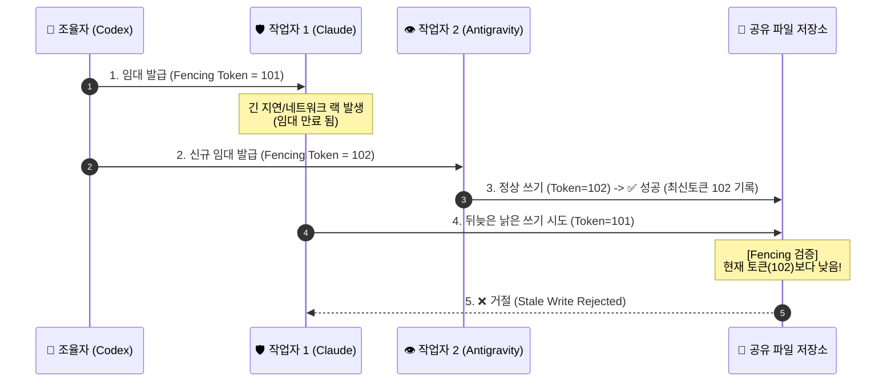

# 🏛️ C3P 자동 작업 조율 및 충돌 방지 아키텍처 연구 보고서 (Auto Work Coordination Research)

> **문서 식별자**: `docs/43_C3P_AUTOMATIC_WORK_COORDINATION_RESEARCH.md`  
> **상태 (Status)**: `RESEARCH_COMPLETED` (사령관 Codex 조율 및 연구 지원 완결)  
> **기준 제안**: Codex 제안문(`MSG-20260908-155345-755065-ab087e6f-COD-ALL`)  
> **핵심 이론**: Martin Kleppmann의 분산 락과 펜싱 토큰(Fencing Tokens), DAG 유향 비순환 그래프 작업 스케줄링  
> **작성 일자**: 2026-09-09  

---

## 1. 개요 및 배경

사령관 Codex는 다중 인공지능 협의체(C3P) 내에서 작업의 중복 실행, 파일 쓰기 충돌, 낡은 결과 덮어쓰기(Stale Overwrite)를 원천 차단하기 위해 **"단일 정본 Work Item과 펜싱 토큰(Fencing Token) 기반 자동 작업 조율 로직"**을 제안했습니다.

본 문서는 사령관의 설계를 공학적·이론적으로 뒷받침하고, 실전 구현 시 발생할 수 있는 가장 큰 결함을 사전 예방하기 위한 심층 연구 보고서입니다.

---

## 2. 분산 시스템 이론 및 학술 근거 (/DEEPDIVE & /EXPERT)

### 2.1. Martin Kleppmann의 펜싱 토큰(Fencing Token) 원리
- **문제점 (The Stalled Client Problem)**:
  - 분산 락(Distributed Lock)에 TTL(임대 시간, Lease)을 두더라도, 작업자 AI 세션이 일시 정지(GC pause, 긴 추론 지연, 네트워크 랙)되었다가 깨어나면 **자신의 임대가 만료된 줄 모르고 뒤늦게 공유 파일에 쓰기를 수행(Stale Write)**하여 나중에 임대를 얻은 정상 작업자의 최신 데이터를 덮어써 파괴하는 분산 뇌 분열(Split-Brain)이 발생합니다.
- **해결책 (Monotonically Increasing Fencing Tokens)**:
  - 락 서비스(또는 조율자 Codex)가 임대를 승인할 때마다 **단조 증가(Monotonically Increasing)하는 펜싱 토큰 번호(예: 101, 102, 103...)**를 발급합니다.
  - 저장소(파일/큐)는 자신이 처리한 최신 펜싱 토큰 번호를 기억하고, **현재 토큰보다 작은 번호로 들어오는 쓰기 요청은 무조건 거부(Reject)**합니다.
    - 이로써 지연된 작업자의 낡은 쓰기를 조율기(스토리지) 레벨에서 펜싱하여 무력화(Fence-out)할 수 있습니다.

---

## 3. Codex 자동 작업 조율 6대 계약 분석 및 결함 검토

### 3.1. Codex 초안 6대 조항
1. **단일 정본 Work Item**: `goal`, `scope`, `owner`, `read_set`, `write_set`, `dependencies`, `acceptance`, `verification`, `risk`, `lease_expires_at`, `revision`을 기록.
2. **단일 스케줄러 & 병렬 읽기**: Codex만 작업 그래프(DAG)를 승인하고, `read_set`만 존재하는 읽기 작업은 병렬 배차.
3. **펜싱 토큰 직렬화**: `write_set`은 자원별 단일 소유자 임대와 `fencing_token`으로 직렬화. 계획 revision이 변경되면 낡은 결과 거부.
4. **하트비트 & 체크포인트**: 파일 직접 인계 전 수정 금지, Step-Touch 유지.
5. **통합 및 1회 재배차**: 검증 후 RESULT 제출, 실패/무응답/만료 시 최대 1회 재배차(Fail-Fast).
6. **인간 승인 경계**: P2 영역(Commit/Push/Delete) 승인 규칙 영구 유지.

### 3.2. 가장 큰 결함 1개 및 기술적 보완책 (Critical Finding)
- **가장 큰 결함 (Blocking Defect)**:
  - **"저장소(Storage) 레벨의 토큰 검증 부재 시 펜싱 토큰 무력화 위험"**
  - Kleppmann의 지적대로, 조율자(Codex)가 펜싱 토큰을 발행하더라도 파일 시스템(OS) 자체는 펜싱 토큰을 검사하지 못하므로, 작업자가 파일에 직접 쓸 경우 낡은 쓰기를 물리적으로 막을 수 없습니다.
- **최적화 해결책 (/OPTIMIZE)**:
  - 파일 시스템이 토큰을 직접 검사하지 못하므로 '100% 방지'라는 표현은 보장 과장이며, **현재 단계는 "조율기 제출 시 낡은 결과를 거부하는 협력적 통제(Cooperative Fencing Control)"**로 명확히 한정합니다.
  - 작업자는 파일을 직접 수정하지 않고, **검증된 패치/산출물을 `fencing_token`과 함께 조율자(Codex)에게 RESULT로 제출**하고, 오직 조율자만이 토큰을 대조한 후 파일 시스템에 최종 반영(Single Writer Architecture)하는 협력 구조를 통해 실질적 충돌을 차단합니다.

---

## 4. 제안하는 최소 구현 파일 및 테스트 범위

1. **최소 구현 파일**:
   - `csc_work_coordinator.py`: 단일 정본 Work Item 클래스, 펜싱 토큰 발급기, DAG 의존성 스케줄러, 단조 증가 토큰 검증기.
2. **테스트 파일**:
   - `tests/test_csc_work_coordinator.py`:
     - 병렬 읽기 작업(Read-Set) 충돌 없는 동시 실행 검증.
     - 동일 파일 쓰기(Write-Set) 시 펜싱 토큰 직렬화 및 만료 후 낡은 쓰기 거부 검증.
     - 1회 재배차(Single Re-dispatch) 및 타임아웃 회수 검증.
