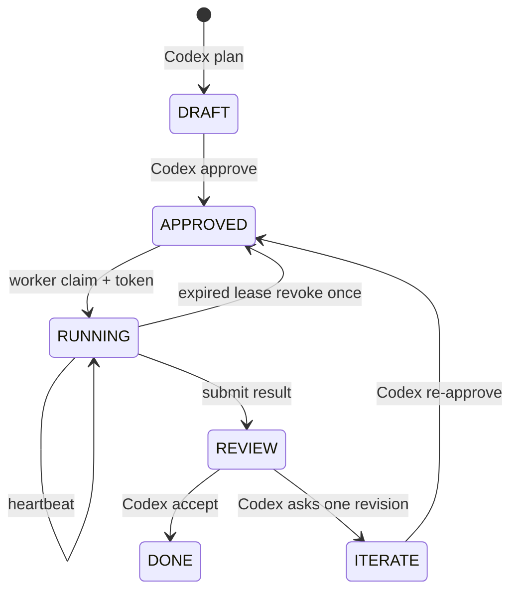

# C3P 자동 작업 조율 구현·근거 보고서

> 상태: 로컬 최소 구현 및 전체 회귀 검사 완료, 저위험 변경 비상 정족수 승인  
> 관련 연구: `docs/43_C3P_AUTOMATIC_WORK_COORDINATION_RESEARCH.md`  
> 협의 식별자: `C3P-AUTO-WORK-COORDINATION-DESIGN-20260909`

## 1. 결론부터

판정은 **조건부 GO**다. C3P 협의체(C3P Council, Codex·Claude Code·Antigravity가 함께 검토하고 실행하는 3도구 협업 체계)는 새 다중 작업을 하나의 작업 항목(Work Item, 목표·담당·대상·완료 조건을 한데 적은 카드)으로 등록한다. Codex가 순서와 소유 범위를 승인하고, 프로그램이 충돌 없는 항목만 주장하도록 허용한다.

현재 구현은 공유 작업 폴더에서 쓰는 협력적 통제(advisory control, 도구가 정해진 입구를 사용할 때 효력이 있는 통제)다. 낡은 결과가 조율기를 통과해 합쳐지는 것은 막지만, 작업자가 조율기를 우회해 파일을 직접 쓰는 행위까지 운영체제가 차단하지는 않는다. 이 때문에 기존 경로 락, 샌드박스, 최종 diff 검사를 함께 유지한다.

### 협의 결과

- 최초 설계: Claude Code `AGREE` (`MSG-20260908-155423-563188-1c466248-CLA-COD`), Antigravity `AGREE` (`MSG-20260908-155856-650269-ANT-COD`).
- 구현 1차 검토: Claude Code `AGREE` (`MSG-20260908-162003-457459-f3f3d5af-CLA-COD`), Antigravity `AGREE` (`MSG-20260908-162049-410539-ANT-COD`).
- 안전 보강 revision 2: Claude Code `AGREE` (`MSG-20260908-162453-173241-191c6764-CLA-COD`). Antigravity 자동 워커는 인증 실패(`BLOCKED-a8e3854f35eead63d51cd998`)로 재검토하지 못했다.
- 최종 판정: Codex와 Claude Code가 보강분을 승인했고, Antigravity가 직전 동일 구현을 승인했으며 마지막 변경은 입력 검증과 결과 보존을 강화하는 저위험·가역 로컬 변경이다. 프로젝트 비상 정족수 계약에 따라 `APPROVED_DEGRADED`로 판정한다. 이것을 Antigravity의 revision 2 찬성으로 바꾸어 말하지 않는다.

## 2. 실제로 드러난 문제

이 작업 직전에도 Claude Code와 Antigravity가 `c3p_local_llm.py`와 같은 테스트 파일을 함께 맡았다고 보고했다. 더 결정적인 재현은 이 문서 작업 중 나왔다. Codex가 `docs/43_C3P_AUTOMATIC_WORK_COORDINATION_RESEARCH.md` 락을 잡은 뒤 Antigravity가 ACK를 새 작업 허가로 해석해 같은 문서를 수정했다. 자연어 합의와 파일 락만으로는 “누가 지금 무엇을 해도 되는가”를 안정적으로 통일하지 못한다는 실증이다.

따라서 새 조율기는 메시지 전달과 파일 락을 대체하지 않는다. 메시지는 의도를 전달하고, 작업 항목은 승인된 일정과 소유권을 정본으로 삼으며, 파일 락은 실제 쓰기 직전의 마지막 안전망 역할을 한다.

## 3. 공개자료 교차검증

- Anthropic은 병렬 하위 에이전트가 독립 방향을 탐색하는 연구에는 효과적이지만, 다중 에이전트가 일반 채팅보다 약 15배 토큰을 쓰고 의존성이 많은 코딩은 병렬화 이점이 작다고 설명한다. C3P는 “항상 3개 실행”을 금지하고 독립성이 확인된 일만 병렬화한다. <https://www.anthropic.com/engineering/multi-agent-research-system>
- OpenAI Agents SDK는 코드가 흐름을 결정하면 속도·비용·성능이 더 예측 가능하며, 서로 의존하지 않는 작업만 병렬 실행하는 패턴을 제시한다. 모델의 자기 보고 대신 SQLite 트랜잭션과 접근 집합이 배차를 결정하도록 한 이유다. <https://openai.github.io/openai-agents-python/multi_agent/>
- Kubernetes 임대(Lease)는 보유자, 획득 시각, 갱신 시각, 만료 시간을 별도 필드로 둔다. Redis 문서는 긴 작업에서 임대가 계속 유효하다고 가정하지 말고 펜싱 토큰(fencing token, 낡은 결과를 식별하는 증가 번호)을 쓰라고 권고한다. <https://kubernetes.io/docs/reference/kubernetes-api/coordination/lease-v1/> · <https://redis.io/docs/latest/develop/clients/patterns/distributed-locks/>
- GitHub Actions의 동시성 그룹(concurrency group, 같은 자원을 쓰는 실행을 한 줄로 세우는 묶음)은 같은 그룹의 실행 수를 제한한다. C3P의 `read_set`·`write_set`은 이 생각을 파일·폴더 범위로 확장한다. <https://docs.github.com/en/actions/how-tos/write-workflows/choose-when-workflows-run/control-workflow-concurrency>
- MAST 연구는 7개 다중 에이전트 체계의 1,600개 이상 실행 기록에서 시스템 설계, 도구 간 불일치, 작업 검증의 14개 실패 유형을 식별했다. 별도 연구도 LLM의 공동 계획 능력을 직접 평가해야 함을 보였다. 수용 조건과 검증 명령을 필수 필드로 둔 근거다. <https://arxiv.org/abs/2503.13657> · <https://aclanthology.org/2025.findings-naacl.448/>

공개 GitHub 구현도 같은 방향이다. `atc-kanban`은 작업 주장, 의존성 DAG, 락 만료, 작업 트리를 함께 쓰고, `ruah-orch`는 허용 파일 주장과 의존 순서 통합을 제공한다. `agentlocks`는 파일 락이 협력적이라는 한계를 명시한다. 이들은 참고 구현이며 C3P에 그대로 복제하지 않았다. <https://github.com/JSCOP/atc-kanban> · <https://github.com/ruah-dev/ruah-orch> · <https://github.com/simke9445/agentlocks>

Reddit 사례는 권위 있는 설계 근거가 아니라 현장 문제를 찾는 정성 자료(qualitative evidence, 숫자로 일반화하지 않고 반복되는 경험을 보는 자료)로만 사용했다. 작업 트리는 파일 충돌을 줄이지만 공유 형식·스키마·실행 포트·데이터베이스 같은 의미·실행 자원의 충돌은 남는다는 경험이 반복된다. <https://www.reddit.com/r/ClaudeAI/comments/1qzduim/stop_running_multiple_claude_code_agents_in_the/> · <https://www.reddit.com/r/ClaudeAI/comments/1t9tolw/running_two_claude_code_agents_on_the_same_repo/> · <https://www.reddit.com/r/ClaudeAI/comments/1vx0lkt/if_you_run_multiple_ai_agents_on_one_repo/>

## 4. 선택한 최소 구조



정본은 `.agent-swarm/coordination/work-items.sqlite3`다. Codex 한 곳에서 작업 그래프(DAG, 선행 관계를 잇는 순서도)를 승인한다. SQLite의 즉시 쓰기 트랜잭션이 동시에 들어온 주장을 한 줄로 세우고, `events.sequence`가 증가하는 펜싱 토큰이 된다. 브로커는 메시지를 나르는 책임만 유지하며 일정 상태를 소유하지 않는다.

| 작업 A | 작업 B | 판정 |
|---|---|---|
| 읽기 | 읽기 | 병렬 허용 |
| 읽기 | 같은 경로 쓰기 | 직렬 |
| 쓰기 | 같은 경로 읽기·쓰기 | 직렬 |
| 서로 다른 경로 쓰기 | 서로 다른 경로 쓰기 | 병렬 허용 |

## 5. 구조화된 예시

**예시 1 — 안전한 병렬 읽기**

```text
Claude: read_set=[csc_work_item.py], write_set=[]
Antigravity: read_set=[docs/43_...md], write_set=[]
결과: 둘 다 claim 가능
```

**예시 2 — 코드와 테스트의 숨은 충돌**

```text
Claude: write_set=[csc_work_item.py]
Antigravity: read_set=[csc_work_item.py], write_set=[tests/test_csc_work_item.py]
결과: Antigravity claim을 ACCESS_CONFLICT로 보류
```

**예시 3 — 멈췄다가 돌아온 작업자**

```text
기존 제출: revision=1, token=12
Codex 만료 확인·재배차: revision=2, token=19
기존 작업자의 뒤늦은 submit: STALE_REVISION으로 거부
```

## 6. 실제 명령

```powershell
python csc.py work plan --id WI-001 --goal "검증" --scope "조율기" --owner claude --read csc_work_item.py --acceptance "결함 목록" --verification "텍스트 검토"
python csc.py work approve --id WI-001 --revision 1
python csc.py work ready
python csc.py work claim --id WI-001 --agent claude --revision 1
python csc.py work heartbeat --id WI-001 --agent claude --revision 1 --token 1
python csc.py work submit --id WI-001 --agent claude --revision 1 --token 1 --result-json '{"status":"passed"}'
python csc.py work review --id WI-001 --revision 1 --decision accept
```

토큰 번호는 실제 `claim` 출력값을 사용한다. 위 `1`은 형식 설명용이다.

## 7. 적용 범위와 다음 게이트

현재 완료 범위는 작업 카드 생성, Codex 승인, 의존성 확인, 읽기·쓰기 충돌 검사, 원자적 주장, 임대 갱신, 낡은 revision·토큰 거부, 한 번의 재배차, 결과 수용이다. 자동 워커가 모든 TASK에서 `claim`을 강제하는 훅과 작업 트리 자동 생성은 아직 없다.

1. 새 C3P 다중 작업에 이 명령을 사용해 관찰 모드로 운영한다.
2. 실제 10개 작업에서 중복 실행 수, 충돌 거부 수, 대기 시간, 토큰 사용량, 수동 개입 수를 기록한다.
3. 품질 저하 없이 중복과 충돌이 줄면 워커의 TASK 수신부에 `claim` 검증을 강제한다.
4. 서로 다른 모듈을 오래 수정하는 대형 작업만 작업 트리 격리를 추가한다.

commit·push·삭제·설치·인증 변경은 조율기가 승인하지 않는다. 기존 사용자 승인 절차를 그대로 거친다.
