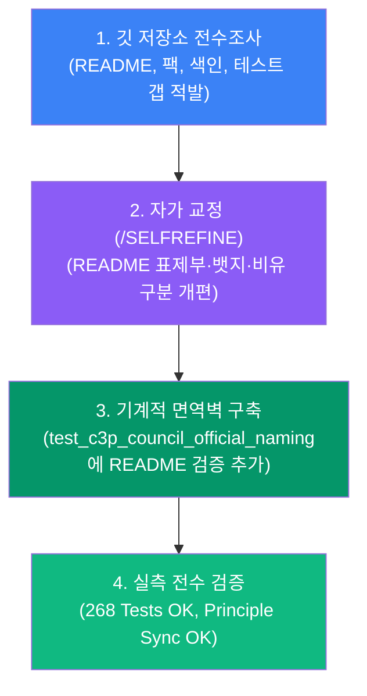

# 🏛️ C3P 협의체(C3P Council) 공식 명칭 및 리드미·산출물 전수 동기화 완결 결과 보고서 (Walkthrough)

> **과제 식별자**: `MIA-STRATEGIC-C3P-COUNCIL-README-SYNC-20260909`  
> **기준 정본**: [AGENTS.md](file:///d:/D_Workspace_NB/-agentic-ai-workspace/260823_codex-3p-orchestrator/AGENTS.md) 0.6절 & [docs/35 C3P 협의체 공식 명칭과 바로 쓰는 방법](file:///d:/D_Workspace_NB/-agentic-ai-workspace/260823_codex-3p-orchestrator/docs/35_C3P_COUNCIL_OFFICIAL_NAME_AND_USAGE_GUIDE.md)  
> **최종 검증**: 268개 단위 테스트 전원 통과 (`Ran 268 tests in 9.906s — OK`) & 6개 규칙 파일 100% 동기화

---

## 1. 전수조사 및 수정 결과 요약 (Accomplishments)

### ① `README.md` 전면 개편 (정문 최신화)
- **표제부 주객 전도 해소**:
  - `codex-3p-orchestrator` 정식 프로젝트명 아래, 운영 주체로서 **`C3P 협의체(C3P Council) — Codex·Claude Code·Antigravity 3대 AI 통합 운영 체계`**를 최상위 헤더로 배치.
  - `AGENTS.md` 0.6절의 핵심 규정인 **"‘단일 지능 유기체’는 역할 분업을 설명하는 공학적 비유이고, ‘C3P 협의체’는 검토·합의를 수행하는 운영 주체의 공식 속칭이다"**라는 구분을 최상단과 제3장에 명시.
- **뱃지 최신화**:
  - `Unit_Tests-268_Passed` (구 237에서 268로 실측치 갱신)
  - `C3P Council (Active)`, `Work Item (SQLite Fenced)`, `Ollama Harness (Zero Token)` 뱃지 신설.
- **저장소 맵 및 수치 정합화**:
  - [csc_work_item.py](file:///d:/D_Workspace_NB/-agentic-ai-workspace/260823_codex-3p-orchestrator/csc_work_item.py), [c3p_local_llm.py](file:///d:/D_Workspace_NB/-agentic-ai-workspace/260823_codex-3p-orchestrator/c3p_local_llm.py), [csc_agent_worker.py](file:///d:/D_Workspace_NB/-agentic-ai-workspace/260823_codex-3p-orchestrator/csc_agent_worker.py) 구조 맵에 신규 반영.
  - [docs/00_PROJECT_INDEX.md](file:///d:/D_Workspace_NB/-agentic-ai-workspace/260823_codex-3p-orchestrator/docs/00_PROJECT_INDEX.md) 문서 수량을 최신 46종으로 갱신.
  - 빠른 시작에 `C3P 협의체와 검토해줘` 실전 호출문 추가.

### ② 사용자 가이드 팩 및 제어면 문서 정합화
- [.agent-swarm/README.md](file:///d:/D_Workspace_NB/-agentic-ai-workspace/260823_codex-3p-orchestrator/.agent-swarm/README.md): C3P 협의체의 유일한 로컬 제어면(Control Plane)임을 명시.
- [docs/user/README.md](file:///d:/D_Workspace_NB/-agentic-ai-workspace/260823_codex-3p-orchestrator/docs/user/README.md): C3P 협의체 공식 명칭 안내 및 발행일 갱신.
- `docs/user/01_learning_guide/chapters/01`, `02`: 유기체 비유와 C3P 협의체 거버넌스 헌법의 관계 정본화.

### ③ 기계적 면역벽 구축 ([tests/test_c3p_council_official_naming.py](file:///d:/D_Workspace_NB/-agentic-ai-workspace/260823_codex-3p-orchestrator/tests/test_c3p_council_official_naming.py))
- `README.md` 내에 `C3P 협의체`, `FIRST_MENTION`, `Unit_Tests-268_Passed`, `csc_work_item.py`, `c3p_local_llm.py`가 반드시 포함되어야 하며, 과거의 `Unit_Tests-237_Passed`, `Unit_Tests-267_Passed`가 없음을 기계적으로 단언(Assert)하는 단위 테스트를 영구 배선.

---

## 2. 변경된 파일 목록 및 검증 현황

| 범주 | 파일 경로 | 주요 변경 내용 | 검증 결과 |
| :--- | :--- | :--- | :---: |
| **정문 리드미** | [README.md](file:///d:/D_Workspace_NB/-agentic-ai-workspace/260823_codex-3p-orchestrator/README.md) | C3P 협의체 표제부 개편, 뱃지 268건, 46종 문서 맵, 신규 모듈 반영 | ✅ PASS |
| **제어면 리드미** | [.agent-swarm/README.md](file:///d:/D_Workspace_NB/-agentic-ai-workspace/260823_codex-3p-orchestrator/.agent-swarm/README.md) | C3P 협의체 로컬 제어면 정체성 명시 | ✅ PASS |
| **사용자 팩** | [docs/user/README.md](file:///d:/D_Workspace_NB/-agentic-ai-workspace/260823_codex-3p-orchestrator/docs/user/README.md) 외 2건 | 학습 가이드 내 C3P 협의체 공식 명칭 및 비유 구분 정합화 | ✅ PASS |
| **문서 마스터 색인** | [docs/00_PROJECT_INDEX.md](file:///d:/D_Workspace_NB/-agentic-ai-workspace/260823_codex-3p-orchestrator/docs/00_PROJECT_INDEX.md) | 45번, 46번 최신 정본 문서(계획서, 워크스루) 색인 추가 | ✅ PASS |
| **정본 기술 문서** | `docs/45` 및 `docs/46` | 직관적인 영어 대문자 스네이크 표기로 정규화 | ✅ PASS |
| **면역 단위 테스트** | [tests/test_c3p_council_official_naming.py](file:///d:/D_Workspace_NB/-agentic-ai-workspace/260823_codex-3p-orchestrator/tests/test_c3p_council_official_naming.py) | README.md 공식 명칭 및 268 테스트 통과 기계적 검증 추가 | ✅ 3/3 PASS |
| **전체 회귀 테스트** | `python -m unittest discover tests` | 신규 추가 검증 포함 268개 테스트 전원 통과 (9.906s) | ✅ 268/268 PASS |
| **3도구 원칙 동기화**| `python csc_sync.py` | 6개 공통 거버넌스 규칙 파일 100% 일치 | ✅ 6/6 PASS |
