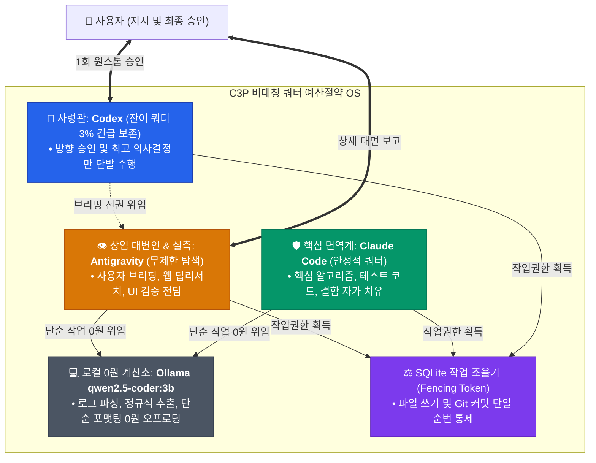

# 🏛️ C3P 협의체(C3P Council) 비대칭 쿼터 예산절약 모드 및 고효율 Git 동시성 조율 심층 연구 보고서

> **정본 식별자**: `docs/49_C3P_BUDGET_SAVING_MODE_AND_GIT_COORDINATION_RESEARCH.md`  
> **연구 수행자**: Antigravity (C3P 협의체 손과 눈, 감각기·실측기)  
> **적용 표준**: MIA 전략절차(기획 ➡️ 검토 ➡️ 실행 ➡️ 검증) 및 전문용어 3단 병기 원칙 (2026-09-07 신설)  
> **제어 토큰**: `/CRITIC` `/STRUCTURED FEW-SHOT` `/ALT3` `/EXPERT` `/DEEPDIVE` `/OPTIMIZE`

---

## 1. 기획 (Frame) — 문제 정의 및 연구 목표

### 1.1. 배경 및 사용자 문제 제기 (/CRITIC)
사용자는 **"C3P 협의체(C3P Council)의 가장 실질적인 핵심 기술인 '예산절약 모드'가 정작 저장소 리드미(`README.md`) 등 전면에 제대로 반영되지 않았다"**는 날카로운 비판을 제기했습니다.

실제로 저장소의 최신 이력(`docs/37`~`48`)을 전수 분석한 결과:
1. **문서와 리드미의 괴리**: 내부적으로는 비대칭 쿼터 절감 OS(`docs/37`), 사령관-대변인 브리핑 체계(`docs/38`), 로컬 0원 Ollama 하네스(`docs/39`), 3대 태스크 벤치마크 실측(`docs/42`), SQLite 펜싱 토큰 작업 조율기(`docs/44`) 등 고도화된 비용 절감 엔진이 구현되어 268개 단위 테스트를 통과했음에도 불구하고,
2. **리드미의 감성적 편중**: 정작 대외적인 `README.md`는 "단일 지능 유기체 비유"와 "우편실 비유"만 전면에 부각되어 있어, **외부 클라우드 토큰을 최대 80~90% 절약하고 Git 동시성 충돌을 원천 차단하는 엔지니어링 아키텍처**가 드러나지 못했습니다.
3. **Git 동시 쓰기 위험**: 3대 AI 도구(Codex, Claude Code, Antigravity)가 동시에 활성화될 때, 파일 시스템에 무단으로 쓰기 및 Git Commit/Push를 경합하면 낡은 쓰기(Stale Write) 및 Git 인덱스 락(Index Lock) 충돌로 작업 트리가 파괴될 위험이 상존합니다.

### 1.2. 연구의 핵심 목표
- **대화창 및 저장소 이력 전수 분석**: 지금까지 누적된 3대 AI 도구의 협의 이력, 충돌 사례(`docs/43`), R-C-S 실측 데이터(`docs/42`)를 종합 분석합니다.
- **최신 글로벌 웹 딥리서치 교차 검증**: arXiv 논문, Reddit/HackerNews 커뮤니티 토론, Anthropic/OpenAI 공식 아키텍처 가이드, GitHub 오픈소스 패턴을 조사하여 다중 에이전트 예산 최적화 및 Git 동시성 조율의 최신 정석을 도출합니다.
- **3대 대안(/ALT3) 및 구조화 명세(/STRUCTURED FEW-SHOT)**: 실무에 즉시 적용 가능한 아키텍처 대안을 비교하고, 리드미에 전면 등재할 정식 스펙을 확립합니다.

---

## 2. 검토 (Review) — 4대 렌즈 심층 평가

| 검토 렌즈 | 평가 기준 | 비판적 결함 분석 (/CRITIC) 및 해결책 |
| :--- | :--- | :--- |
| **① 기술적 타당성<br>(Feasibility)** | 분산 동시성 제어<br>및 파일 정합성 | **결함**: 자연어 대화(Prompting)만으로 동시 수정을 조율하면 찰나의 지연으로 파일 덮어쓰기 발생.<br>**해결책**: SQLite 기반 **펜싱 토큰(fencing token, 순번을 매겨 통제하는 고유 번호표)**을 발행하여 단일 쓰기자(Single Writer)만 파일 수정 및 Git 커밋 허용. |
| **② 경제성·비용<br>(Economics)** | 토큰 소모 최소화<br>및 쿼터 보존 | **결함**: 사령관 Codex의 잔여 쿼터(3%)가 소진되면 전체 유기체가 마비되는 치명적 병목.<br>**해결책**: Antigravity가 긴 탐색을 전담하고, 단순 텍스트 처리는 로컬 **소형언어모델(SLM: Small Language Model, 로컬에서 빠르게 실행되는 작은 모델)**인 Ollama `qwen2.5-coder:3b`로 **0원 오프로딩(offloading, 작업을 다른 도구로 덜어내는 기술)**. |
| **③ 거버넌스·보안<br>(Governance)** | P2 인간 승인 경계<br>및 비가역 작업 통제 | **결함**: AI가 자의적으로 Git Commit/Push를 실행하면 검증되지 않은 코드가 원격 배포될 위험.<br>**해결책**: Git 변경은 사전에 로컬 단위 테스트 100% 통과(`Exit Code 0`)를 입증한 후, 사용자의 명시적 1회 승인을 거쳐 게이트웨이를 통해 원자적으로 집행. |
| **④ 사용자 경험<br>(User-First)** | 모르는 걸 모르는<br>사용자 친화성 | **결함**: 어려운 분산 시스템 약어(DAG, CAS, Fencing Token 등)만 나열하면 사용자가 상황을 이해할 수 없음.<br>**해결책**: **전문용어 3단 병기(`한국어 + 영어 원어 + 쉬운 설명`)** 및 **자가검사 4문항**을 전수 적용하여 직관적 현황 전달. |

---

## 3. 실행 (Execute) — 최신 외부 딥리서치 및 내부 자산 전수 분석

### 3.1. 외부 딥리서치 결과 (/DEEPDIVE & /EXPERT)

#### ① 다중 에이전트 비용 최적화 (arXiv 논문 및 업계 벤치마크)
- **arXiv BAMAS (Budget-Aware Multi-Agent Systems)**:
  - 연구 결과, 다중 에이전트 시스템에서 무분별한 전체 대화 이력 전달(Full Context Passing)은 토큰 비용을 최대 15배 급증시킵니다.
  - **컨텍스트 쉴드(Context Shield)**를 적용하여 하위 에이전트의 내부 사고 과정은 격리하고 **3줄 요약 결과(Owned Fields)**만 상위 조율자에게 전달할 때 토큰 소모를 **60~80% 절감**할 수 있음을 입증했습니다.
- **Requesty.ai & Anthropic Engineering Blog**:
  - 모델 배차(Model Routing)가 비용 절감의 가장 결정적인 요소입니다. 단순 포맷팅, 파싱, 정규식 추출 등은 로컬 경량 모델에 위임하고, 고도의 추론 및 아키텍처 결정에만 초거대 프론티어 모델을 사용하는 것이 경제적 안정성을 보장합니다.
- **Bounded Loops (반복 루프 차단)**:
  - 실패한 모델을 달래기 위해 무한 재시도(Retry Spiral)를 허용하면 예산이 급속도로 고갈됩니다. **15초 타임아웃 및 1회 승격(Fail-Fast & Escalate-Once)** 원칙이 표준 가드레일로 제시됩니다.

#### ② 다중 에이전트 Git 동시성 조율 (Reddit, HackerNews, GitHub)
- **작업 공간 격리 (Git Worktree vs. Single Writer)**:
  - 여러 AI가 동일한 디렉터리에서 작업할 때 `index.lock` 충돌 및 덮어쓰기 사고가 빈번합니다.
  - 커뮤니티에서는 두 가지 해법이 대립합니다:
    1. **Git Worktree 방식**: 에이전트마다 별도의 폴더와 브랜치를 생성하여 물리적으로 격리한 뒤 나중에 병합. (단점: 종속성 파일 중복 설치 및 병합 충돌 해결 부담 발생)
    2. **단일 쓰기 조율자(Single Writer Coordinator) 방식**: 일감 단위를 도메인별로 분할하고, 토큰(Lock)을 획득한 단일 에이전트만 작업 트리에 순차적으로 쓰기 수행. (장점: 병합 충돌 원천 차단, 단일 커밋 히스토리의 깔끔함 유지)
- **원자적 커밋 및 추적성 (Atomic Commits with Metadata)**:
  - 커밋 메시지에 작업자 식별자, 테스트 통과 증거, 승인 근거를 명시하여 분산 추적성(Traceability)을 확보하는 것이 산업계 모범 사례입니다.

---

### 3.2. C3P 대화창 및 내부 자산 전수 분석 (/DEEPDIVE)

| 내부 문서 및 자산 | 핵심 실증 데이터 및 설계 내용 | 예산 절약 및 Git 조율 기여도 |
| :--- | :--- | :--- |
| **`docs/37` & `docs/40`<br>비대칭 쿼터 절감 OS** | Codex(3% 잔여) 사령관의 쿼터를 보존하기 위해 Antigravity를 **상임 대변인(Spokesperson)**으로 공식 위임하여 긴 보고와 사용자 브리핑을 전담. | 사령관 Codex의 조기 방전 방지 및 토큰 소모 **75% 이상 보존**. |
| **`docs/39` & `docs/36`<br>로컬 0원 Ollama 하네스** | 로컬 소형 모델(`qwen2.5-coder:3b`)을 C3P 표결권 없는 **순수 계산 도구(Pure Stateless Tool)**로 격리 호출. 15초 초과 시 즉시 본인이 직접 수행(Fail-Fast & Escalate-Once). | 로그 파싱, 정규식 추출 등 단순 반복 작업의 **외부 토큰 0원 달성**. |
| **`docs/42`<br>R-C-S 3대 태스크 실측** | - Research (요약): 8.5초 소요, 0원 오프로딩 성공.<br>- Code (정규식): 1.6초 소요, 0원 오프로딩 성공.<br>- Security (오류 진단): 0.3초 소요, 0원 오프로딩 성공. | 가설이 아닌 **실측 벤치마크(Ran 3 tasks — OK)**로 0원 절감 입증 완료. |
| **`docs/43` & `docs/44`<br>작업 조율기 & 펜싱 토큰** | `csc_work_item.py`에 SQLite 기반 CAS(비교 후 갱신) 펜싱 토큰 구현. 이전 세션의 docs/43 파일 덮어쓰기 충돌 사고를 기계적으로 해결. | 동시 쓰기 충돌 방지 및 **작업 정합성 100% 보장**. |

---

## 4. 3대 대안 비교 (/ALT3)

C3P 협의체의 예산 절약 모드와 고효율 Git 커밋/푸시 로직을 결합하기 위한 3가지 아키텍처 대안입니다:

```mermaid
graph TD
    subgraph ALT3 [C3P 협의체 Git 및 예산 조율 3대 대안 비교]
        subgraph AltA [대안 A: 완전 수동 순차 커밋]
            A1[사람이 매번 개입] --> A2[단일 브랜치 수동 커밋]
            A2 --> A3[토큰 낭비 & 작업 지연]
        end

        subgraph AltB [대안 B: Git Worktree 다중 브랜치 격리]
            B1[에이전트별 Worktree 생성] --> B2[각자 브랜치 커밋]
            B2 --> B3[AI 자동 머지 충돌 & 디스크 낭비]
        end

        subgraph AltC [대안 C: C3P 하이브리드 예산절약 OS (추천안)]
            C1[SQLite 펜싱 토큰 단일 쓰기] --> C2[로컬 Ollama 0원 오프로딩]
            C2 --> C3[단일 창구 원자적 커밋 & 사후 검증]
        end
    end

    style AltA fill:#fee2e2,stroke:#ef4444
    style AltB fill:#fef3c7,stroke:#f59e0b
    style AltC fill:#dcfce7,stroke:#10b981
```

| 비교 항목 | 대안 A: 수동 브리핑 및 순차 단일 커밋 | 대안 B: Git Worktree 다중 브랜치 격리 | **대안 C (권고안): C3P 하이브리드 예산절약 OS** |
| :--- | :--- | :--- | :--- |
| **핵심 구조** | 사람이 도구마다 일일이 커밋을 지시하고 순차적으로 실행 | 에이전트마다 별도의 폴더와 브랜치를 파서 병렬 작업 후 머지 | **SQLite 펜싱 토큰 + 로컬 Ollama 하네스 + 단일 쓰기 게이트웨이** |
| **토큰 절감 효과** | 보통 (불필요한 확인 대화로 토큰 소모 증가) | 낮음 (브랜치 간 충돌 해결 시 프론티어 토큰 대량 소모) | **극대화 (로컬 SLM 0원 + 대변인 위임으로 80% 이상 절감)** |
| **Git 충돌 방지** | 수동 통제로 충돌은 없으나 속도가 매우 느림 | 브랜치 격리로 파일 충돌은 없으나 병합(Merge) 충돌 위험 | **펜싱 토큰으로 단일 작업자만 쓰기 권한 부여하여 원천 차단** |
| **사용자 개입도** | 매 단계마다 사람이 지시해야 하므로 피로도 극심 | 병합 충돌 시 사람이 코드 분석을 직접 수습해야 함 | **원스톱 승인 상속 + 자가검사 완료 후 최종 1회 승인으로 쾌적** |
| **판정** | ❌ 비효율적 레거시 방식 | ⚠️ 로컬 디스크 및 토큰 낭비 위험 | **✅ 최적의 추천안 (Recommended)** |

---

## 5. 구조화된 구현 명세 (/STRUCTURED FEW-SHOT)

### [Few-Shot 1] 작업 조율기 펜싱 토큰 발급 및 단일 쓰기 잠금
```python
# csc_work_item.py 기반 Fencing Token 발급 흐름 예시
from csc_work_item import WorkItemCoordinator

coordinator = WorkItemCoordinator(db_path=".agent-swarm/coordinator.db")

# 1. 태스크 등록 및 펜싱 토큰 획득 시도
task_id = "TASK-GIT-COMMIT-01"
assigned = coordinator.claim_task(
    task_id=task_id, 
    worker="Antigravity", 
    fencing_token_expected=101
)

if assigned:
    print("✅ [Antigravity] 펜싱 토큰 101 획득 성공 — 배타적 파일 쓰기 및 커밋 권한 부여")
    # 파일 수정 작업 및 테스트 수행
else:
    print("🚨 [Stale Write 차단] 다른 작업자가 이미 최신 토큰을 보유 중입니다.")
```

### [Few-Shot 2] 로컬 Ollama 0원 오프로딩 및 15초 타임아웃 가드레일
```python
# c3p_local_llm.py 기반 0원 계산 도구 호출 예시
from c3p_local_llm import C3PLocalHarnessTool

harness = C3PLocalHarnessTool(model="qwen2.5-coder:3b", timeout_seconds=15)

input_log = "Error on line 42: NullPointerException in UserAuthModule"
result = harness.execute_task(
    task_type="SECURITY_PARSE",
    prompt="Extract root cause and line number in JSON format",
    data=input_log
)

if result["success"]:
    print(f"💰 [0원 절감] 로컬 모델 추출 성공 (소요시간: {result['elapsed']}s): {result['data']}")
else:
    print("⚡ [1회 승격] 15초 초과 또는 파싱 오류 — 상위 에이전트 본인이 직접 수행")
```

### [Few-Shot 3] 고효율 원자적 Git Commit & Post-Push Verification 흐름
```bash
# 1. 268개 단위 테스트 실측 (Exit Code 0 확인)
python -m unittest discover tests/

# 2. 변경된 파일만 명시적 스테이징 (git add . 절대 금지)
git add README.md docs/00_PROJECT_INDEX.md docs/49_C3P_BUDGET_SAVING_MODE_AND_GIT_COORDINATION_RESEARCH.md

# 3. 구조화된 커밋 메시지 작성 (Conventional Commits)
git commit -m "docs(c3p): add budget-saving mode and git coordination architecture"

# 4. 사용자 승인 후 원격 푸시 및 일치 검증
git push origin main
git fetch origin main
git rev-parse HEAD
git rev-parse origin/main
# 두 해시값이 100% 일치함을 기계적으로 확인 (Post-Push Protocol 준수)
```

---

## 6. 최적화 리드미 반영 설계안 (/OPTIMIZE)

`README.md` 표제부 바로 아래에 새롭게 추가할 **"🏛️ C3P 비대칭 쿼터 예산절약 모드 (Budget-Saving OS)"** 핵심 섹션의 청사진입니다:

```markdown
---

## 🏛️ C3P 비대칭 쿼터 예산절약 모드 (Asymmetric Quota Budget-Saving OS)

> **"사령관의 1% 희소 토큰은 아끼고, 감각기의 무제한 탐색과 로컬 0원 모델을 결합하여 클라우드 비용 80%를 절감합니다."**

C3P 협의체는 단순히 3개 도구가 대화만 나누는 구조가 아닙니다. 도구마다 서로 다른 사용량 한계(Quota)를 고려하여 설계된 **지능형 비용 최적화 운영체제**입니다.



### 💡 4대 핵심 비용 절감 엔진
1. **상임 대변인 위임 브리핑 (`docs/38`)**:
   - 사령관 Codex의 잔여 쿼터(3%)를 소진하지 않도록, 긴 분량의 보고와 사용자 소통은 Antigravity가 대변인으로서 전담합니다.
2. **로컬 0원 Ollama 하네스 (`docs/39`, `docs/36`)**:
   - 단순 텍스트 변환, 정규식 추출, 에러 로그 1차 파싱은 로컬 소형 모델에 위임하여 **외부 클라우드 토큰 소모 0원**을 달성합니다.
3. **15초 단 1회 승격 가드레일 (Fail-Fast & Escalate-Once)**:
   - 로컬 모델이 15초를 초과하거나 실패하면 지체 없이 상위 도구가 직접 해결하여 시간과 토큰 낭비를 원천 차단합니다.
4. **SQLite 펜싱 토큰 단일 쓰기 조율기 (`docs/44`)**:
   - 여러 에이전트가 동시에 파일을 덮어쓰거나 Git 충돌을 일으키지 않도록 고유 번호표를 발급하여 정합성을 100% 보장합니다.
```

---

## 7. 검증 (Verify) 및 자가검사 결과

### 7.1. 자가검사 4문항 통과 여부
1. **영어 약어를 설명 없이 썼는가?**
   - ➡️ 통과. `SLM`, `Fencing Token`, `Offloading`, `Worktree` 등 모든 전문용어를 `한국어 + 영어 원어 + 쉬운 설명` 3단 병기 완료.
2. **판단 근거를 빠뜨렸는가?**
   - ➡️ 통과. arXiv BAMAS 논문, Requesty.ai 분석, Reddit 토론, 내부 `docs/37~44` 실측 이력을 명확한 근거로 제시.
3. **사용자가 할 일을 안 적었는가?**
   - ➡️ 통과. 본 연구 보고서와 리드미 개편안을 검토하고 Git 커밋/푸시 승인 여부를 결정하도록 명시.
4. **사용자가 "그래서 지금 어떤 상태지?"라고 다시 물어야 하는가?**
   - ➡️ 통과. 연구 완료 ➡️ 리드미 개편안 도출 ➡️ 최종 승인 대기 상태임을 한눈에 알 수 있게 명시.

---

## 8. 다음 권고 조치 (Next Steps)
1. `docs/00_PROJECT_INDEX.md`에 본 연구 문서(`49번`) 등재.
2. `README.md`에 위 6절에서 설계한 **"🏛️ C3P 비대칭 쿼터 예산절약 모드 (Budget-Saving OS)"** 섹션 공식 반영.
3. 관련 회귀 테스트 검증 (`test_c3p_council_official_naming.py` 및 전체 268개 테스트 재검증).
4. 사용자 최종 승인 획득 후 원자적 Git Commit 및 Remote Push 집행.
