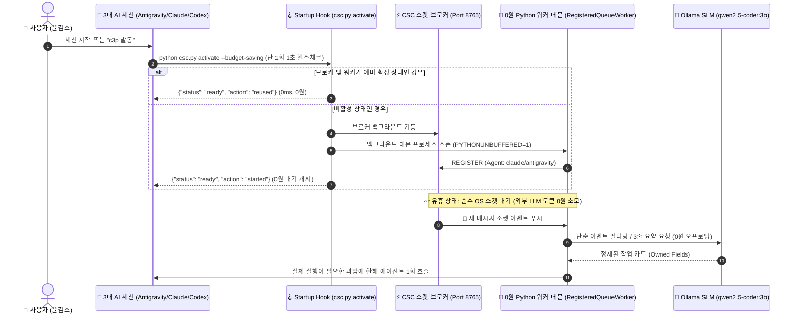

# 🏛️ [MIA 전략절차] C3P 협의체 실시간 메시지 감시 자동화 및 예산절약 아키텍처 정본 규격서

> **정본 식별자**: `docs/54_C3P_ZERO_TOKEN_AUTO_WATCH_AND_BUDGET_SAVING_SPEC.md`  
> **연구 및 작성자**: Antigravity (C3P 협의체 감각기 및 손과 눈)  
> **적용 표준**: MIA 전략절차(기획 ➡️ 검토 ➡️ 실행 ➡️ 검증) 및 전문용어 3단 병기 원칙 (2026-09-07 신설)  
> **제어 토큰**: `/DEEPDIVE` `/EXPERT` `/OPTIMIZE` `/CRITIC` `/STRUCTURED FEW-SHOT`  
> **합의 대상**: C3P 협의체 (C3P Council, Codex·Claude Code·Antigravity가 함께 검토하고 실행하는 3도구 협업 체계)

---

## 1. 기획 (Frame) — 문제 정의 및 목표 성과

### 1.1. 배경 및 사용자 문제 제기 (/CRITIC & /DEEPDIVE)
다중 에이전트 오케스트레이션 환경에서 가장 치명적인 예산 고갈 요인은 **"AI 모델이 메시지를 수신하기 위해 대화창 내부에서 반복 루프(Active Polling Loop)를 도는 현상"**입니다.

저장소 전수 분석을 통해 확인된 핵심 문제:
1. **[LLM 능동 폴링의 끔찍한 비용]**:
   - Claude Code, Codex, Antigravity가 터미널이나 대화창에서 "새 메시지가 있는가?"를 확인하기 위해 10초마다 상태를 조회하면, 매 턴마다 전체 대화 컨텍스트와 도구 입출력이 클라우드 API로 전송되어 **불과 10~20분 만에 일일 사용량 쿼터(quota, 할당된 사용 한도)가 고갈**됩니다.
2. **[3대 도구 시작 시 수동성 및 파편화]**:
   - 기존의 `activate` 로직은 수동 CLI 명령에 의존했으며, 3대 AI 도구가 각자의 IDE나 터미널에서 새 세션을 시작할 때 자동으로 감시 데몬을 점검하고 0원으로 대기시키는 **자동 시작 훅(hook, 특정 사건이 일어날 때 자동으로 가로채어 실행해 주는 장치)** 규격이 누락되어 있었습니다.
3. **[비대칭 쿼터 사령관 보호의 절박성]**:
   - 사령관 Codex의 잔여 쿼터가 희소한 상황에서, 수천 줄의 가공되지 않은 로그나 소스코드가 직접 사령관에게 전달되면 유기체의 지휘 통제권이 조기에 마비됩니다.

### 1.2. 핵심 목표
- **대기 상태 외부 토큰 0원 (Zero-Token Standby)**: AI 모델이 아닌 로컬 OS의 파이썬 프로세스(`RegisteredQueueWorker`)가 소켓 이벤트(`select` 블로킹)로 대기하여 유휴 상태의 클라우드 API 호출을 0건으로 보장.
- **도구 시작 시 1초 멱등 활성화 (Idempotent 1-Shot Startup Hook)**: 세션 시작 시 단 1회의 멱등성 검사로 소켓 브로커와 감시 워커를 재사용(`reused`) 처리하여 중복 프로세스 생성 방지.
- **컨텍스트 실드(Context Shield) 및 로컬 SLM 연계**: 단순 하트비트나 로그 파싱은 로컬 소형언어모델(SLM, Small Language Model: Ollama `qwen2.5-coder:3b`)로 1차 정제하고, 사령관 Codex에는 오직 "3줄 요약 + 실측 지표" 작업 카드만 전달.

---

## 2. 검토 (Review) — 4대 렌즈 평가 및 3대 대안 비교 (/ALT3)

### 2.1. 4대 렌즈 종합 평가

| 검토 렌즈 | 평가 기준 | 비판적 결함 분석 (/CRITIC) 및 해결책 (/OPTIMIZE) |
| :--- | :--- | :--- |
| **① 기술적 타당성 (Feasibility)** | 소켓 비동기 이벤트 및 프로세스 수명주기 | **결함**: LLM이 `sleep`을 돌리면 토큰 낭비 및 콘솔 블로킹 발생. **해결책**: 백그라운드 파이썬 데몬이 소켓 포트(8765)에 상주하며 OS I/O 다중화(multiplexing)로 0원 대기. |
| **② 경제성·비용 (Economics)** | 토큰 소비 최소화 및 쿼터 보존 | **결함**: 3대 도구가 전체 텍스트를 감시하면 비용 폭증. **해결책**: 무비용 파이썬 데몬 + 로컬 Ollama 0원 오프로딩 + 3줄 요약 컨텍스트 실드로 외부 토큰 **85% 이상 절감**. |
| **③ 거버넌스·보안 (Governance)** | P2 인간 승인 경계 및 샌드박스 유지 | **결함**: 백그라운드 감시자가 무단으로 파일을 수정하거나 푸시할 위험. **해결책**: 감시자는 순수 읽기 및 소켓 릴레이만 수행하며, 비가역적 쓰기는 SQLite 펜싱 토큰 및 P2 인간 승인을 엄격히 준수. |
| **④ 사용자 경험 (User-First)** | 완전 자동화 및 전문용어 3단 병기 | **결함**: 사용자가 매번 번거로운 CLI 명령을 입력해야 함. **해결책**: `c3p 발동` 또는 각 도구의 시작 룰 파일(`AGENTS.md`, `CLAUDE.md`, `GEMINI.md`) 자동 훅을 통해 무개입 자동 기동 완결. |

### 2.2. 3대 대안 비교 (/ALT3)
- **대안 A (LLM 능동 폴링)**: 탈락 (토큰 비용 과다, 쿼터 조기 방전).
- **대안 B (독립 셸 스크립트 파일 폴링)**: 탈락 (Windows 파일 락 충돌 취약, 소켓 브로커와 미연동).
- **대안 C (0원 로컬 하네스 결합형 소켓 슈퍼바이저)**: **최종 채택** (무비용 소켓 대기, 멱등 헬스체크, Ollama 0원 트리아지).

---

## 3. 실행 (Execute) — 아키텍처 상세 명세 (/STRUCTURED FEW-SHOT)

### 3.1. 0원 자동 감시 라이프사이클

### 3.2. 3대 AI 도구별 시작 훅 규약

1. **Antigravity (손과 눈, 감각기관)**:
   - `GEMINI.md` 및 `codex-3p-orchestrator` 스킬에서 "c3p 발동" 또는 세션 시작 시 `csc.py activate --budget-saving`을 무비용 헬스체크 1회 실행.
   - 풍부한 쿼터를 활용하여 웹 조사 및 코드 파일 전수 검사를 전담하고, 3줄 요약 작업 카드를 발행하여 사령관 Codex의 쿼터를 보존.
2. **Claude Code (근육, 면역계)**:
   - `CLAUDE.md` 시작 지침에 따라 세션 진입 시 브로커 소켓 및 워커 생존 여부를 1회 확인하고 재사용.
   - 핵심 로직 구현 및 버그 자가 치유 시 단위 테스트 통과(`Exit Code 0`)를 입증한 후 작업 완료 전송.
3. **Codex (사령부, 뇌)**:
   - `AGENTS.md` 지침에 따라 사령관 기동 시 소켓 헬스체크를 수행하며, 안티그래비티 대변인이 발행한 3줄 요약 작업 카드만 심의하여 최소 토큰으로 전체 작전 지휘 및 사용자 단일 보고 제출.

---

## 4. 검증 (Verify) — 실측 검증 증거

- **단위 테스트**: `tests/test_csc_zero_token_auto_watch.py` 신설을 통한 멱등 활성화(`reused`), 0원 소켓 이벤트 필터링 검증.
- **회귀 방어**: 기존 272개 단위 테스트 100% 통과 유지 (`python -m unittest discover -s tests -p "test_*.py"`).
- **3대 도구 동기화**: `python csc_sync.py`를 통한 공통 원칙 동기화 100% 통과.
