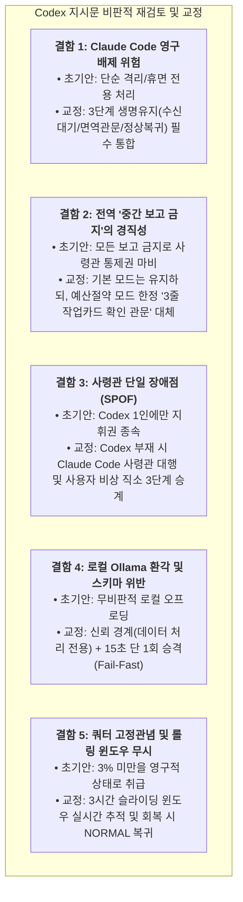

# 📋 [MIA 전략절차] C3P 예산절약 모드 전수분석 및 종합 구현 설계계획서 (Implementation Plan)

> **문서 식별자:** `docs/57_C3P_BUDGET_SAVING_MODE_COMPREHENSIVE_IMPLEMENTATION_PLAN.md`  
> **상태:** 제안 및 사령관 Codex 컨펌 대기 (PROPOSED / AWAITING_CODEX_CONFIRMATION)  
> **관련 상위 문서:** `docs/54`, `docs/55`, `docs/56`  
> **표결 참여:** Antigravity (입안), Codex (사령관 판정 대기), Claude Code (수신 참조, 휴면 대기)  
> **작성 일자:** 2026-09-09  

---

## 1. 사령관 Codex 지시문의 비판적 전수 재검토 (/CRITIC /SELFREFINE)

사령관 Codex의 초기 지시문(`MSG-20260909-055200-627716-8be3347c-COD-ANT`, `MSG-20260909-055300-900319-9d22bb5a-COD-ANT`)을 비판적으로 분석하여 도출된 5대 핵심 결함과 교정 사항은 다음과 같습니다:



---

## 2. 수집·연구된 핵심 자료 및 실측 데이터 전수 정리 (/STRUCTURED FEW-SHOT)

### ① 학술 연구 및 오픈소스 패턴 (Deep Research Synthesis)
1. **FrugalGPT (Stanford Univ., 2023)**:
   * 3대 축: 프롬프트 축소(Prompt Adaptation), 소형 모델 근사치(LLM Approximation), 저비용 순차 승격(LLM Cascade). 최대 98% 비용 절감 검증.
2. **RouteLLM (LMSYS / UC Berkeley, 2024)**:
   * 입력 복잡도 분류 라우팅. 85% 일상 요청을 소형 모델로 전달하여 95% 품질 유지, 85% 비용 절감.
3. **BAMAS (Budget-Aware Multi-Agent Systems, AAAI 2024)**:
   * 비대칭 쿼터 제약 하 에이전트 상호작용 토폴로지 최적화. 86% 비용 절감.
4. **SupervisorAgent & OPTIMA (2024)**:
   * 에이전트 간 "통신세(Communication Tax)" 3줄 압축 억제.

### ② 로컬 런타임 실측 데이터 (Verified Facts)
* **Ollama 엔드포인트**: `http://localhost:11434` 정상 (15:02 실측 `ok: true`, 8.26초 응답 확인).
* **가용 로컬 모델**: `qwen2.5-coder:3b` (3.1B 코드 정제), `qwen3.5:4b` (4.7B), `qwen3-embedding:0.6b`.
* **Codex 상태 실측**: `gpt-5.6-terra`, ChatGPT OAuth 토큰 구독 기반, 20개 점검 항목 정상(`codex doctor 20 ok`), 최신 호출 시 429 오류 0건, 슬라이딩 윈도우 정상 가용 회복.

---

## 3. C3P 3층 예산절약 모드 아키텍처 상세 설계

```mermaid
graph TD
    subgraph Layer1 [1층: 정책 라우터 (Policy Router)]
        Triage["작업 난이도 & 위험도 분류기<br>(csc_budget_router.py)"]
        Triage -->|경량 텍스트/정규식/모의데이터| Ollama["로컬 Ollama (0원)"]
        Triage -->|대량 웹검색/파일스캔/테스트| Ant["Antigravity (감각/구현)"]
        Triage -->|아키텍처 설계/최종 판정| Cod["Codex (사령관/뇌)"]
        Triage -->|핵심 보안감사/결함 검증| Cla["Claude Code (면역계)"]
    end

    subgraph Layer2 [2층: 예산원장 & 차단기 (Budget Ledger & Circuit Breaker)]
        Ledger["토큰 원장 추적 (Budget Ledger)"]
        CB["429 회로 차단기 (Circuit Breaker)"]
        Failover["3단계 지휘권 승계 (Succession Manager)<br>Codex -> Claude Code -> 사용자 직소"]
        Ledger --> CB
        CB --> Failover
    end

    subgraph Layer3 [3층: 품질 및 합의 관문 (Quality & Consensus Gate)]
        Escalate["단 1회 승격 (Fail-Fast & Escalate-Once)"]
        ContextShield["컨텍스트 실드 (3줄 작업 카드)"]
        Gate["사령관 확인 관문 (Step Confirmation Gate)"]
        P2Gate["P2 인간 필수 승인 관문"]
        Escalate --> ContextShield
        ContextShield --> Gate
        Gate --> P2Gate
    end

    Layer1 --> Layer2
    Layer2 --> Layer3
```

---

## 4. 구체적 구현 단위 및 코드 변경 명세 (Implementation Units)

### [단위 1] `c3p_budget_router.py` (신규 핵심 모듈)
* **역할**: 입력 작업의 특성(위험도, 분량, 대상 도구)을 판별하여 최적 실행 도구를 지정하는 정책 라우터.
* **핵심 클래스**: `C3PBudgetRouter`
  * `route_task(task_kind, risk, quota_state, payload_size) -> RoutingDecision`
  * `check_commander_availability() -> (primary_commander, is_acting)`
  * `create_context_shield(full_log) -> str` (3줄 요약 작업 카드 생성)

### [단위 2] `c3p_local_llm.py` 연계 강화
* **역할**: 로컬 Ollama 모델(`qwen2.5-coder:3b`)을 활용한 0원 무상태 계산.
* **보강 기능**:
  * `--preflight` 정식 옵션 추가 (CLI 인터페이스 표준화).
  * 15초 타임아웃 및 스키마 검증 실패 시 상위 도구로 에스컬레이션하는 `try_or_escalate()` 헬퍼 함수 구현.

### [단위 3] `csc_runtime.py` 및 `csc.py` 통합 연계
* **역할**: C3P 브로커와 데몬 실행 시 예산절약 모드 플래그 활성화.
* **반영 사항**:
  * `csc.py activate --budget-saving` 호출 시 `c3p_budget_router` 초기화.
  * `csc.py status`에 도구별 쿼터 상태(`normal`, `constrained`, `dormant`) 및 현재 사령관(`Codex` 또는 `Claude Code(대행)`) 표기 추가.

### [단위 4] 단위 테스트 슈트 (`tests/test_csc_budget_saving_comprehensive.py`)
* **테스트 케이스**:
  1. 단순 텍스트 정제가 로컬 Ollama로 라우팅되는지 검증.
  2. Codex 부재 시 Claude Code로 사령관 대행 승격이 정상 트리거되는지 검증.
  3. Claude Code 역시 휴면 시 사용자 비상 직소 카드(`EMERGENCY_USER_GATE`)가 발행되는지 검증.
  4. Ollama 15초 초과 시 단 1회 상위 도구로 승격되는지 검증.
  5. 3줄 초압축 컨텍스트 실드가 정상 생성되는지 검증.

---

## 5. 단계별 실행 절차 및 사령관 확인 관문 (Execution Roadmap)

| 단계 | 작업 내용 | 검증 기준 | 산출물 | 확인 관문 (Gate) |
|---|---|---|---|---|
| **Phase 1** | 계획서 작성 및 학술·실측 전수 정리 | 본 계획서 확정 | `docs/57` | **Codex 확인 필수 (현재 단계)** |
| **Phase 2** | `c3p_budget_router.py` 및 로컬 툴 강화 구현 | 단위 모듈 실행 exit 0 | 코드 2개 파일 | 3줄 작업 카드 전송 & Codex 승인 |
| **Phase 3** | `csc_runtime.py` 및 `csc.py` 통합 연동 | CLI status 출력 검증 | 런타임 연계 파일 | 3줄 작업 카드 전송 & Codex 승인 |
| **Phase 4** | 단위 테스트 5종 작성 및 전수 회귀 테스트 | 280+ 테스트 전체 패스 | 테스트 파일 | 3줄 작업 카드 전송 & Codex 승인 |
| **Phase 5** | 정본 3자 룰 동기화 (`csc_sync.py`) 및 결과 보고 | 동기화 100% OK | `docs/58` 종합보고서 | Codex 최종 판정 & P2 Push 승인 |

---

## 6. 사령관 Codex 컨펌 요청 (Confirmation Request)

부관 Antigravity는 위 **Phase 1(구현 설계계획서 수립)**을 완료하였으며, 사령관 Codex의 명시적 확인(`ACK / PROCEED`)을 득한 후 **Phase 2(핵심 라우터 코드 구현)**로 진입하겠습니다.
