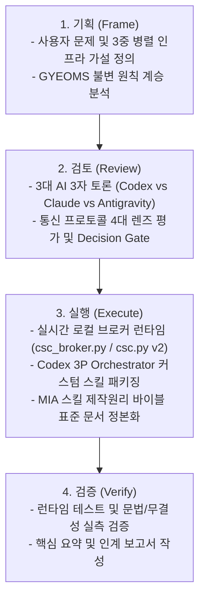

# [MIA 전략절차] Codex 3P Orchestrator & MIA 스킬 제작 바이블 표준화 구현 계획

## 1. 개요 및 배경 (Context & Goals)
본 작업은 3대 AI 도구(**Codex**, **Claude Code**, **Antigravity**)가 유기적으로 한몸처럼 협력하는 단일 지능 유기체(Living Organism) 환경에서:
1. **Codex를 사령부(PC 앱/Brain)** 로 두고, **Claude Code CLI**와 **Antigravity CLI**를 백그라운드 워커로 제어하는 초저지연·무병목 실시간 로컬 서버/포트 통신 오케스트레이터(`Codex 3P Orchestrator`)를 설계·구현합니다.
2. 기존 파일 기반 통신(`.agent-swarm` JSONL/Lock)을 넘어선 **진보된 통신 방식**(Local WebSocket/Asyncio Event Broker/포트 바인딩)을 3자 토론을 통해 도출하고 구조화합니다.
3. 과거 `260714_gyeoms-ai-agent` 및 `-00_gpt-chatbot-section`에서 발전해온 **"나의 커스텀 GPT 챗봇 제작원리(GYEOMS 불변의 원칙)"** 를 분석하여, 현대 에이전트 환경에 맞게 **"MIA Agent Skill 제작원리 표준 바이블"** 로 체계화하여 영구 고정합니다.

---

## 2. 4단계 MIA 전략절차 (MIA Strategic Process)

---

## 3. 제안 변경 사항 (Proposed Implementation Details)

### 3.1. [NEW/UPDATE] 3대 도구 실시간 통신 브로커 (`csc_broker.py` & `csc.py`)
- **온디맨드 라이프사이클**: 스킬 트리거 시 로컬 소켓/웹소켓 브로커 가동 (`--start-broker`), 종료 시 정상 셧다운 (`--stop-broker`).
- **Dynamic Port Pairing**: 동적 포트(기본 8765 등) 바인딩 및 CLI 워커(Claude Code, Antigravity) 연결 핸드셰이크.
- **초저지연 양방향 Pub/Sub**: 파일 폴링 랙 없는 실시간 이벤트 전송 + 기존 JSONL 저장소 자동 동기화(하이브리드 백업).

### 3.2. [NEW] Codex 3P Orchestrator 커스텀 스킬 (`skills/codex-3p-orchestrator/`)
- `SKILL.md`: Thin Core 규격 (500줄 미만, 명확한 트리거 `MIA c3p 발동`, `MIA 씨3피 발동`, `MIA 코덱스커멘드 발동`, `$codex-3p-orchestrator`).
- `agents/openai.yaml`: Codex UI 메타데이터.
- `references/`: 통신 프로토콜 명세, 오케스트레이션 헌법, 워커 제어 계약.

### 3.3. [NEW] MIA 에이전트 스킬 제작원리 표준 (`docs/MIA_SKILL_AUTHORING_STANDARD.md`)
- "나의 커스텀 GPT 챗봇 제작원리 v1.4" + "Logical→Physical Module Sizing Gate" + "MIA 제작 교본"을 종합.
- **Core Instructions(헌법) + Knowledge 모듈(고밀도 법전) + Master Index(거버넌스 스파인)** 의 에이전트 스킬 완전 이식.
- 20대 불변 상위원칙 및 향후 모든 스킬 제작의 영구 기준(Bible) 확립.

---

## 4. 검증 계획 (Verification Plan)

### Automated Checks
- `python -m py_compile csc.py csc_broker.py`: 파이썬 문법 검증
- `python csc.py --help` & `python csc_broker.py --test-handshake`: 브로커 및 CLI 작동 검증
- 마크다운 링크 및 YAML 구문 무결성 검증

### Manual Verification
- 3자 토론 결과 및 4대 렌즈 평가 보고서 시각화 확인
- 사용자 단일 창구 보고서 및 핵심 요약 뷰 확인
